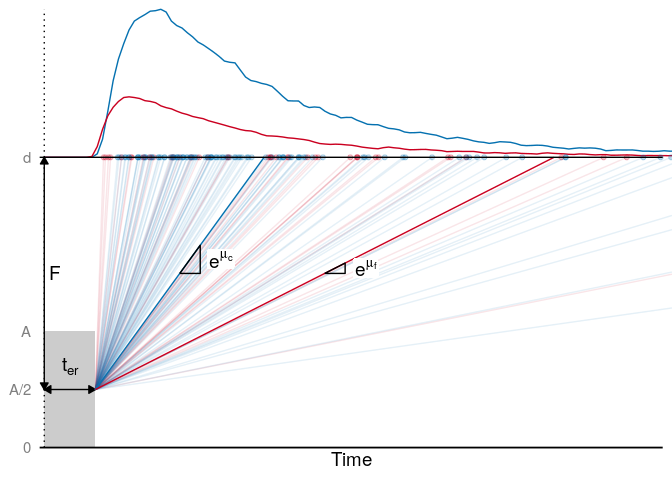

# actr-lba

This repository contains the code associated with the manuscript **Capturing Dynamic Performance in a Cognitive Model: Estimating ACT-R Memory Parameters with the Linear Ballistic Accumulator**.

  

## Analysis notebooks

- [Simulation: Recovering ACT-R parameters using the LBA](./analysis/01_simulation_parameter_recovery.md)
- [Example Application: Modelling Changing Retrieval Performance in Empirical Data](./analysis/02_empirical_example.md)
- [Extra visualisations of the mapping between ACT-R and LBA](./analysis/03_visualisations.md)

## Links

  - [Shiny app](https://mavdvelde.shinyapps.io/actr-lba/)
  - [OSF project](https://osf.io/wpvj7/)
