Simulation: Recovering ACT-R parameters using the LBA
================
Maarten van der Velde
Last updated: 2021-10-12

# Overview

In this notebook, we generate retrieval data using an ACT-R model, and
then attempt to recover the original ACT-R parameters using an LBA.

We perform several simulations (only 3 and 4 are reported in the paper):

1.  **Single participant doing 100,000 trials.**<br> To get an idea of
    best-case recovery performance.
2.  **Single participant doing a varying number of trials.**<br> To see
    how recovery performance changes with the size of the available
    data.
3.  **Multiple participants doing 100 trials.**<br> To see how well
    individual parameters can be recovered in a “typical” experimental
    sample.
4.  **Multiple participants doing a varying number of trials.**<br> To
    see how individual parameter recovery performance changes with the
    size of the available data.

# Setup

``` r
library(dplyr)
library(ggplot2)
library(rtdists)
library(purrr)
library(furrr)
library(tidyr)
library(truncdist)
library(cowplot)
library(grid)
library(rlang)

future::plan("multiprocess", workers = 6) # Set to desired number of cores

theme_paper <- theme_classic(base_size = 14) + 
  theme(axis.text = element_text(colour = "black"))


use_cached_results <- TRUE # Set to FALSE to rerun simulations (takes time!)
```

## Parameter recovery functions

Define the objective function to minimise (adapted to lognormal
distribution from the [rtdists
example](https://github.com/rtdists/rtdists/blob/master/examples/examples.lba.R)):

``` r
obj_fun <- function(par, rt, response, distribution = "lnorm") {
  # simple parameters
  spar <- par[!grepl("[12]$", names(par))]  
  
  # distribution parameters:
  dist_par_names <- unique(sub("[12]$", "", grep("[12]$" ,names(par), value = TRUE)))
  dist_par <- vector("list", length = length(dist_par_names))
  names(dist_par) <- dist_par_names
  for (i in dist_par_names) dist_par[[i]] <- as.list(unname(par[grep(i, names(par))]))
  dist_par$sdlog_v <- c(1, dist_par$sdlog_v) # fix first sdlog_v to 1

  # get summed log-likelihood:
  d <- do.call(dLBA, args = c(rt=list(rt), response=list(response), spar, dist_par, 
                               distribution=distribution, silent=TRUE))
  if (any(d < 0e-10)) return(1e6) 
  else return(-sum(log(d)))
}
```

Define the parameter recovery function, which randomly initialises the
LBA parameters (within some reasonable constraints to promote
convergence) and then uses the nlminb optimiser to find the best fit,
evaluating each iteration with the objective function:

``` r
recover_parameters <- function(data, obj_fun) {
  
  # Generate random starting values
  init_par <- runif(6)
  init_par[2] <- init_par[2] + 1 # Ensure b is larger than A
  init_par[3] <- runif(1, 0, min(data$rt)) # Ensure t0 is mot too large
  init_par[4] <- -init_par[4] # Ensure meanlog_v1 is negative
  init_par[5] <- init_par[4] - init_par[5] # Ensure meanlog_v2 is negative and lower than meanlog_v2
  names(init_par) <- c("A", "b", "t0", "meanlog_v1", "meanlog_v2", "sdlog_v2")
  
  # Run optimiser
  fit <- nlminb(obj_fun,
                start = init_par, 
                rt = data$rt, response = data$response,
                lower = c(0, 0, 0, -Inf, -Inf, 0)) # Set lower bounds on parameters
  
  # Only keep parameter estimates if the optimiser converged successfully
  if (fit$convergence == 0 && !is.infinite(fit$objective)) {
    return(as.list(c(fit$par, objective = fit$objective)))
  }
  
  return(NULL)
  
}
```

# Simulation 1: single participant, 100,000 trials

We’ll use an ACT-R model of a single participant to generate response
data (RT and choice) for a retrieval task with two response options. In
the context of cued retrieval, we can think of these two options as
representing (1) the correct response and (2) all possible incorrect
responses.

The simulated participant will have a single non-retrieval time
\(t_{er}\), but the latency factor \(F\) will be drawn from a uniform
distribution, and the activation of the memory chunks will be drawn from
a normal distribution to represent the activation noise component in
ACT-R.

## Generate data

``` r
set.seed(2021)
```

Simulate 100,000 trials:

``` r
n_trials <- 1e5
```

Set the ACT-R parameters:

``` r
# Latency factor F
lf_lower <- 2
lf_upper <- 3

# Non-retrieval time t_er
t_er <- .5

# Activation of correct answer
a_c_mu <- -.5
a_c_sd <- 1

# Activation of incorrect answer
a_f_mu <- -1.5
a_f_sd <- 1.5
```

Generate the data:

``` r
sim_actr <- tibble(
  f = runif(n_trials, min = lf_lower, max = lf_upper),
  a_c = rnorm(n_trials, mean = a_c_mu, sd = a_c_sd),
  a_f = rnorm(n_trials, mean = a_f_mu, sd = a_f_sd),
  t = rep(t_er, n_trials)
) %>%
  rowwise() %>%
  mutate(rt = f * exp(-max(a_c, a_f)) + t,
         response = ifelse(a_c > a_f, 1, 2)) %>%
  ungroup()
```

``` r
head(sim_actr)
```

    ## Warning: `...` is not empty.
    ## 
    ## We detected these problematic arguments:
    ## * `needs_dots`
    ## 
    ## These dots only exist to allow future extensions and should be empty.
    ## Did you misspecify an argument?

    ## # A tibble: 6 x 6
    ##       f     a_c     a_f     t    rt response
    ##   <dbl>   <dbl>   <dbl> <dbl> <dbl>    <dbl>
    ## 1  2.45 -1.02   -0.0456   0.5  3.07        2
    ## 2  2.78 -1.20   -1.70     0.5  9.74        1
    ## 3  2.71 -1.46   -0.626    0.5  5.57        2
    ## 4  2.38  0.364  -3.04     0.5  2.15        1
    ## 5  2.64 -0.573  -0.698    0.5  5.18        1
    ## 6  2.70 -0.0759 -1.26     0.5  3.41        1

``` r
prop.table(table(sim_actr$response))
```

    ## 
    ##       1       2 
    ## 0.71041 0.28959

Note: a response of 1 indicates a correct answer, 2 an incorrect answer.

To confirm that the data generation process of ACT-R is equivalent to
that of the LBA, we’ll also calculate the density function of an LBA
with the same parameters.

The `rtdists` package allows us to define drift rate with a lognormal
distribution, which means that we can keep the untransformed (i.e.,
log-scale) activation mean and SD from ACT-R.

``` r
A <- lf_upper - lf_lower
b <- lf_upper

dlba_dat <- crossing(rt = seq(0, 20, by = .01),
                     response = c(1, 2))

sim_lba <- bind_cols(dlba_dat,
                     density = dLBA(rt = dlba_dat$rt,
                                    response = dlba_dat$response,
                                    A = A,
                                    b = b,
                                    t0 = t_er,
                                    meanlog_v = c(a_c_mu, a_f_mu),
                                    sdlog_v = c(a_c_sd, a_f_sd),
                                    distribution = "lnorm",
                                    silent = TRUE)) %>%
  mutate(rt = ifelse(response == 1, rt, -rt),
         model = "LBA")
```

As the plot below shows, there is an excellent correspondence between
the distribution of responses of the ACT-R model (black histogram) and
the density function of the LBA (orange curve).

``` r
sim_actr %>%
  mutate(rt = ifelse(response == 1, rt, -rt),
         model = "ACT-R") %>%
  ggplot(aes(x = rt, colour = model)) +
  geom_vline(xintercept = 0, lty = 2, colour = "grey80") +
  geom_histogram(aes(y = ..density..), binwidth = .25, colour = "black", fill = "white", size = .1) +
  geom_line(data = sim_lba, aes(y = density), size = rel(1.1), alpha = .8) +
  scale_x_continuous(limits = c(-20, 20)) +
  scale_y_continuous(expand = c(0, 0)) +
  scale_colour_manual(values = c("#e66101", "#5e3c99")) +
  labs(x = "RT (s)",
       y = "Density",
       colour = NULL) +
  guides(colour = FALSE) +
  theme_paper +
  theme(axis.ticks.y = element_blank(),
        axis.text.y = element_blank(),
        strip.background = element_blank(),
        strip.text = element_blank())
```

    ## Warning: `guides(<scale> = FALSE)` is deprecated. Please use
    ## `guides(<scale> = "none")` instead.

    ## Warning: Removed 2225 rows containing non-finite values (stat_bin).

    ## Warning: Removed 2 rows containing missing values (geom_bar).

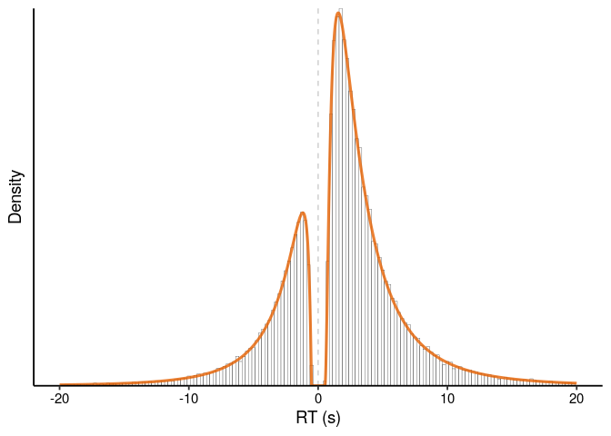<!-- -->

## Recover parameters

``` r
if (use_cached_results) {

  s1_param_recov_best <- readRDS(file.path("..", "output", "s1_param_recov_best.rds"))
  
} else {
  
  n_attempts <- 100 # More attempts = more chances to reach global optimum
  s1_param_recov <- future_map_dfr(1:n_attempts, function(x) recover_parameters(data = sim_actr, obj_fun = obj_fun))
  saveRDS(s1_param_recov, file.path("..", "output", "s1_param_recov.rds"))

  # Only keep the best fit across all attempts, which is closest to the global optimum
  s1_param_recov_best <- filter(s1_param_recov, objective == min(objective))
  saveRDS(s1_param_recov_best, file.path("..", "output", "s1_param_recov_best.rds"))

}
```

To compare the recovered parameter estimates to the original ACT-R
parameters that generated the data, transform from LBA parameters to
ACT-R parameters:

``` r
f_lower_recov <- s1_param_recov_best$b - s1_param_recov_best$A
f_upper_recov <- s1_param_recov_best$b
f_recov <- (f_upper_recov + f_lower_recov)/2
t_recov <- s1_param_recov_best$t0
a_c_recov <- s1_param_recov_best$meanlog_v1
a_f_recov <- s1_param_recov_best$meanlog_v2
a_c_sd_recov <- rep(1, nrow(s1_param_recov_best))
a_f_sd_recov <- s1_param_recov_best$sdlog_v2


s1_par_comp <- tibble(parameter = rep(c("F_lower", "F_upper", "F", "t_er", "A_correct", "A_incorrect", "A_correct_sd", "A_incorrect_sd"), each = nrow(s1_param_recov_best)),
                      original = rep(c(lf_lower, lf_upper, (lf_upper + lf_lower)/2, t_er, a_c_mu, a_f_mu, a_c_sd, a_f_sd), each = nrow(s1_param_recov_best)),
                      recovered = c(f_lower_recov, f_upper_recov, f_recov, t_recov, a_c_recov, a_f_recov, a_c_sd_recov, a_f_sd_recov))
```

Comparison of original ACT-R parameters to recovered parameter estimates
from the
LBA:

``` r
ggplot(s1_par_comp, aes(x = original, y = recovered, colour = parameter)) +
  geom_abline(lty = 2) +
  geom_point() +
  coord_equal() +
  labs(x = "Original parameter value",
       y = "Recovered parameter value",
       colour = "Parameter") +
  theme_paper
```

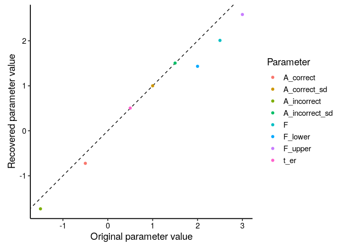<!-- -->

Difference between the original ACT-R parameters and the recovered
parameter estimates from the LBA:

``` r
ggplot(s1_par_comp, aes(x = parameter, y = original - recovered)) +
  geom_hline(yintercept = 0, lty = 2) +
  geom_point(aes(colour = parameter)) +
  ylim(-max(abs(s1_par_comp$original - s1_par_comp$recovered)), max(abs(s1_par_comp$original - s1_par_comp$recovered))) +
  guides(colour = FALSE) +
  labs(x = NULL,
       y = "Original - recovered parameter value") +
  theme_paper
```

    ## Warning: `guides(<scale> = FALSE)` is deprecated. Please use
    ## `guides(<scale> = "none")` instead.

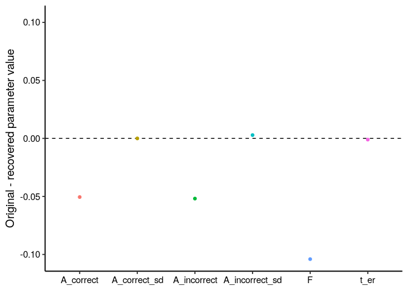<!-- -->

# Simulation 2: single participant, vary dataset size

How accurately can we recover parameters from smaller datasets?

``` r
if (use_cached_results) {

  s2_param_recov_best <- readRDS(file.path("..", "output", "s2_param_recov_best.rds"))
  
} else {
  
  dataset_sizes <-  c(25, 50, 100, 250, 500, 1000, 2500, 5000, 10000, 25000, 50000)
  n_attempts <- 100
  s2_param_recov <- list()
  
  for(i in 1:length(dataset_sizes)) {
    s2_param_recov[[i]] <- future_map_dfr(1:n_attempts, function(x) recover_parameters(data = sim_actr[1:dataset_sizes[i],], obj_fun = obj_fun)) %>%
      mutate(dataset_size = dataset_sizes[i])
    
  }
  
  s2_param_recov <- bind_rows(s2_param_recov)
  saveRDS(s2_param_recov, file.path("..", "output", "s2_param_recov.rds"))
  
  # Only keep the best fit across all attempts, which is closest to the global optimum
  s2_param_recov_best <- s2_param_recov %>%
    group_by(dataset_size) %>%
    filter(objective == min(objective)) %>%
    slice(n()) %>% # If there are multiple rows with the exact same value, only keep the first
    ungroup()
  
  s2_param_recov_best <- bind_rows(s2_param_recov_best,
                                   mutate(s1_param_recov_best, dataset_size = 100000))
  saveRDS(s2_param_recov_best, file.path("..", "output", "s2_param_recov_best.rds"))
  
}
```

To compare the recovered parameter estimates to the original ACT-R
parameters that generated the data, transform from LBA parameters to
ACT-R parameters:

``` r
f_lower_recov <- s2_param_recov_best$b - s2_param_recov_best$A
f_upper_recov <- s2_param_recov_best$b
f_recov <- (f_upper_recov + f_lower_recov)/2
t_recov <- s2_param_recov_best$t0
a_c_recov <- s2_param_recov_best$meanlog_v1
a_f_recov <- s2_param_recov_best$meanlog_v2
a_c_sd_recov <- rep(1, nrow(s2_param_recov_best))
a_f_sd_recov <- s2_param_recov_best$sdlog_v2


s2_par_comp <- tibble(parameter = rep(c("F_lower", "F_upper", "F", "t_er", "A_correct", "A_incorrect", "A_correct_sd", "A_incorrect_sd"), each = nrow(s2_param_recov_best)),
                   original = rep(c(lf_lower, lf_upper, (lf_lower + lf_upper)/2, t_er, a_c_mu, a_f_mu, a_c_sd, a_f_sd), each = nrow(s2_param_recov_best)),
                   recovered = c(f_lower_recov, f_upper_recov, f_recov, t_recov, a_c_recov, a_f_recov, a_c_sd_recov, a_f_sd_recov),
                   dataset_size = rep(s2_param_recov_best$dataset_size, 8))
```

Comparison of original ACT-R parameters to recovered parameter estimates
from the
LBA:

``` r
ggplot(mutate(s2_par_comp, n = dataset_size), aes(x = original, y = recovered, colour = parameter)) +
  facet_wrap(~ n, labeller = function(x) label_both(labels = x, sep = " = ")) +
  geom_abline(lty = 2) +
  geom_point() +
  coord_equal() +
  labs(x = "Original parameter value",
         y = "Recovered parameter value",
         colour = "Parameter") +
  theme_paper
```

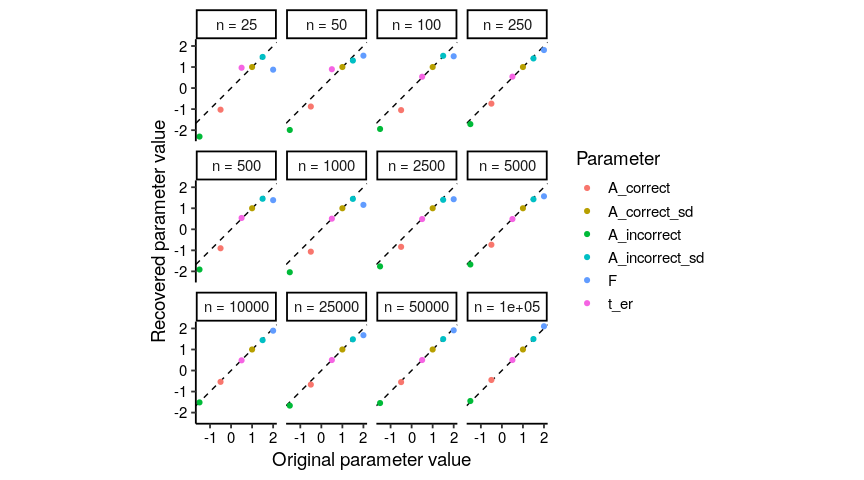<!-- -->

Difference between the original ACT-R parameters and the recovered
parameter estimates from the LBA, as a function of datset size:

``` r
s2_par_comp %>%
  rowwise() %>%
  mutate(ae = abs(original - recovered)) %>%
  group_by(dataset_size) %>%
  mutate(mae = mean(ae)) %>%
  ggplot(aes(x = dataset_size, y = mae)) +
  geom_line(lty = 2) +
  geom_jitter(aes(y = ae, colour = parameter), height = 0, width = .025, alpha = .75) +
  geom_point(size = rel(1.5)) +
  scale_x_log10(labels = scales::comma_format()) +
  labs(x = "Dataset size",
       y = "Absolute error") +
  guides(colour = FALSE) +
  theme_paper 
```

    ## Warning: `guides(<scale> = FALSE)` is deprecated. Please use
    ## `guides(<scale> = "none")` instead.

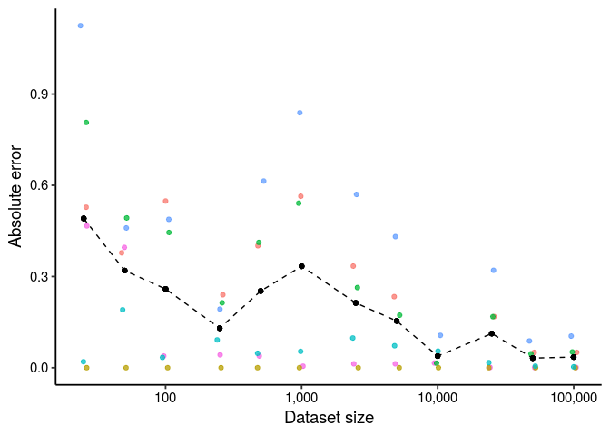<!-- -->

# Simulation 3: multiple participants, 100 trials

Here, we extend the previous example by simulating data from multiple
participants, each with their own memory parameters.

Each participant will have a latency factor \(F\) uniform distribution,
defined by a mean \(\overline{F} \sim N_+(1, .5)\) and a range
\(R_F \sim N_+(.1, .05)\). Each participant will also have a
non-retrieval time \(t_{er} \sim N_+(.75, .5)\). The activation of their
memory chunks will be drawn from two normal distributions, with mean
\(\mu_{c} \sim N_-(-.5, .5)\) and \(\mu_{f} \sim N_-(-1.5, .5)\), and
standard deviation \(\sigma_{c} = 1\) and
\(\sigma_{f} \sim N_+(1.5, .5)\).

## Generate data

``` r
set.seed(2021)
```

``` r
# Number of trials to simulate per participant:
n_trials <- 100

# Number of participants to simulate:
n_participants <- 25
```

Set the ACT-R parameters:

``` r
# Latency factor F
lf <- rtrunc(n_participants, spec = "norm", mean = 1, sd = .5, a = 0, b = Inf)
lf_range <- rtrunc(n_participants, spec = "norm", mean = .1, sd = .05, a = 0, b = Inf)
lf_lower <- lf - .5 * lf_range
lf_upper <- lf + .5 * lf_range

# Non-retrieval time t_er
t_er <- rtrunc(n_participants, spec = "norm", mean = .75, sd = .5, a = 0, b = Inf)

# Activation of correct answer
a_c_mu <- rtrunc(n_participants, spec = "norm", mean = -.5, sd = .5, a = -Inf, b = 0)
a_c_sd <- rep(1, n_participants)

# Activation of incorrect answer
a_f_mu <- rtrunc(n_participants, spec = "norm", mean = -1.5, sd = .5, a = -Inf, b = 0)
a_f_sd <- rtrunc(n_participants, spec = "norm", mean = 1.5, sd = .5, a = 0, b = Inf)
```

Distribution of
parameters:

``` r
tibble(participant = 1:n_participants, lf_lower, lf_upper, t_er, a_c_mu, a_c_sd, a_f_mu, a_f_sd) %>%
  pivot_longer(-participant, "parameter") %>%
  ggplot(aes(x = parameter, y = value, colour = parameter)) +
  geom_boxplot(outlier.shape = NA) +
  geom_jitter(height = 0, width = .1) +
  labs(x = "Parameter",
         y = "Value",
         colour = "Parameter") +
  guides(colour = FALSE) +
  theme_paper
```

    ## Warning: `guides(<scale> = FALSE)` is deprecated. Please use
    ## `guides(<scale> = "none")` instead.

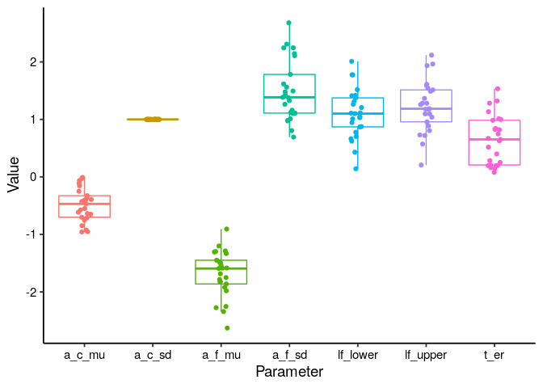<!-- -->

Alternative
visualisation:

``` r
tibble(participant = 1:n_participants, lf_lower, lf_upper, t_er, a_c_mu, a_c_sd, a_f_mu, a_f_sd) %>%
  pivot_longer(-participant, "parameter") %>%
  mutate(parameter = factor(parameter, 
                            levels = c("a_c_mu", "a_f_mu", "a_c_sd", "a_f_sd", "lf_lower", "lf_upper", "t_er"),
                            labels  = c(expression(mu[c]), expression(mu[f]), expression(sigma[c]), expression(sigma[f]), expression(F[a]), expression(F[b]), expression(t[er])))) %>%
  ggplot(aes(y = parameter, x = value, colour = (parameter))) +
  facet_grid(parameter ~ ., scales = "free", switch = "y", labeller = labeller(parameter = label_parsed)) +
  geom_hline(aes(yintercept = parameter), colour = "grey90", lty = 3) +
  geom_jitter(height = .1, width = 0, size = .5) +
  labs(x = NULL,
       y = NULL) +
  guides(colour = FALSE) +
  scale_colour_viridis_d() +
  theme_paper +
  theme(strip.background = element_blank(),
        strip.text.y.left = element_text(angle = 0, size = rel(1.25)),
        axis.text.y = element_blank(),
        axis.ticks.y = element_blank(),
        axis.line.y = element_blank())
```

    ## Warning: `guides(<scale> = FALSE)` is deprecated. Please use
    ## `guides(<scale> = "none")` instead.

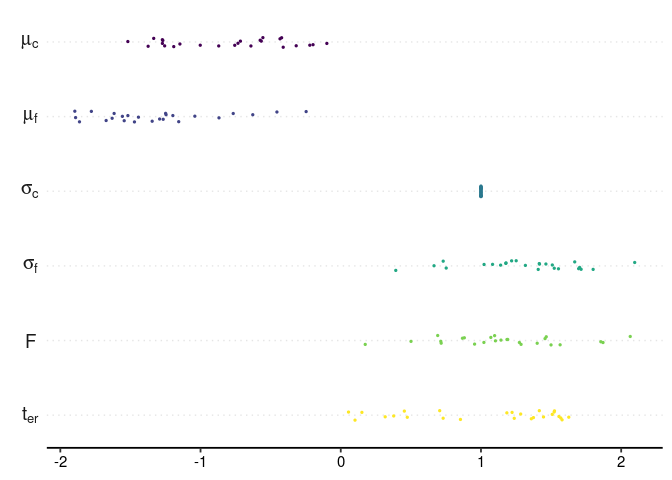<!-- -->

``` r
ggsave(file.path("..", "output", "sim-param-values.png"), width = 2, height = 2, dpi = 600)
```

Generate the data:

``` r
sim_actr <- tibble(participant = rep(1:n_participants, each = n_trials),
       f = runif(n_participants * n_trials, min = rep(lf_lower, each = n_trials), max = rep(lf_upper, each = n_trials)),
       a_c = rnorm(n_participants * n_trials, mean = rep(a_c_mu, each = n_trials), sd = rep(a_c_sd, each = n_trials)),
       a_f = rnorm(n_participants * n_trials, mean = rep(a_f_mu, each = n_trials), sd = rep(a_f_sd, each = n_trials)),
       t = rep(t_er, each = n_trials)
) %>%
  rowwise() %>%
  mutate(rt = f * exp(-max(a_c, a_f)) + t,
         response = ifelse(a_c > a_f, 1, 2)) %>%
  ungroup()
```

``` r
head(sim_actr)
```

    ## Warning: `...` is not empty.
    ## 
    ## We detected these problematic arguments:
    ## * `needs_dots`
    ## 
    ## These dots only exist to allow future extensions and should be empty.
    ## Did you misspecify an argument?

    ## # A tibble: 6 x 7
    ##   participant     f    a_c    a_f     t    rt response
    ##         <int> <dbl>  <dbl>  <dbl> <dbl> <dbl>    <dbl>
    ## 1           1 1.01  -0.346 -1.09  0.841  2.27        1
    ## 2           1 0.908 -3.23   0.614 0.841  1.33        2
    ## 3           1 0.978 -0.642  1.11  0.841  1.16        2
    ## 4           1 0.990  0.164 -2.83  0.841  1.68        1
    ## 5           1 0.932 -0.310 -1.78  0.841  2.11        1
    ## 6           1 0.916 -0.381 -4.39  0.841  2.18        1

``` r
prop.table(table(sim_actr$response))
```

    ## 
    ##      1      2 
    ## 0.7468 0.2532

RT
distributions:

``` r
ggplot(mutate(sim_actr, rt = ifelse(response == 1, rt, -rt)), aes(x = rt, group = participant, colour = participant)) +
  geom_line(stat = "density", adjust = .5, n = 2^12, na.rm = F, alpha = .5) +
  geom_vline(aes(xintercept = 0), lty = 2, colour = "grey80") +
  scale_x_continuous(breaks = c(-15, 0, 15)) +
  scale_y_continuous(expand = c(0,0), breaks = NULL) +
  coord_cartesian(xlim = c(-20, 20)) +
  labs(x = "RT (s)",
       y = "Density") +
  guides(colour = FALSE) +
  theme_paper +
  theme(strip.background = element_blank(),
        strip.text = element_blank())
```

    ## Warning: `guides(<scale> = FALSE)` is deprecated. Please use
    ## `guides(<scale> = "none")` instead.

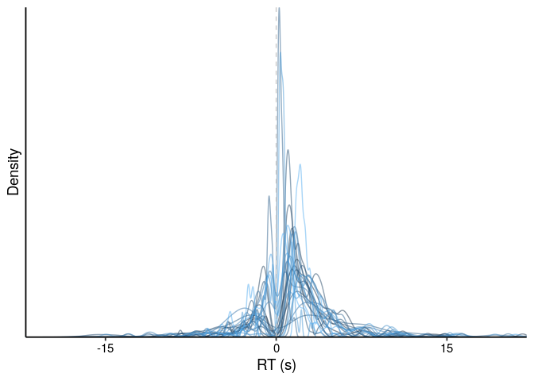<!-- -->

## Recover parameters

``` r
if (use_cached_results) {
  
  s3_param_recov_best <- readRDS(file.path("..", "output", "s3_param_recov_best.rds"))
  
} else {
  
  n_attempts <- 250 # More attempts = more chances to reach global optimum
  
  sim_actr_split <- split(sim_actr, sim_actr$participant)
  
  s3_param_recov <- future_map_dfr(sim_actr_split, function(x) {
    future_map_dfr(1:n_attempts, function(y) {
      recover_parameters(data = x, obj_fun = obj_fun)
    }) %>%
      mutate(participant = x$participant[1])
  })
  
  saveRDS(s3_param_recov, file.path("..", "output", "s3_param_recov.rds"))
  
  # Only keep the best fit across all attempts
  s3_param_recov_best <- s3_param_recov %>%
    group_by(participant) %>%
    filter(objective == min(objective)) %>%
    slice(1) # If there are multiple equally good fits, just keep the first
  
  saveRDS(s3_param_recov_best, file.path("..", "output", "s3_param_recov_best.rds"))
  
}
```

``` r
# f_recov <- s3_param_recov_best$b - .5*s3_param_recov_best$A
f_lower_recov <- s3_param_recov_best$b - s3_param_recov_best$A
f_upper_recov <- s3_param_recov_best$b
f_recov <- (f_upper_recov + f_lower_recov)/2
t_recov <- s3_param_recov_best$t0
a_c_recov <- s3_param_recov_best$meanlog_v1
a_f_recov <- s3_param_recov_best$meanlog_v2
a_c_sd_recov <- rep(1, n_participants)
a_f_sd_recov <- s3_param_recov_best$sdlog_v2


s3_par_comp <- tibble(
  participant = rep(1:n_participants, 8),
  parameter = rep(c("F_lower", "F_upper", "F", "t_er", "A_correct", "A_incorrect", "A_correct_sd", "A_incorrect_sd"), each = n_participants),
  original = c(lf_lower, lf_upper, lf, t_er, a_c_mu, a_f_mu, a_c_sd, a_f_sd),
  recovered = c(f_lower_recov, f_upper_recov, f_recov, t_recov, a_c_recov, a_f_recov, a_c_sd_recov, a_f_sd_recov)
)
```

Comparison of original ACT-R parameters to recovered parameter estimates
from the LBA:

``` r
s3_par_comp_plot <- s3_par_comp %>%
  filter(parameter != "A_correct_sd") %>%
  mutate(parameter = factor(parameter, 
                            levels = c("A_correct", "A_incorrect", "A_incorrect_sd", "F_lower", "F_upper", "F", "t_er"),
                            labels  = c(expression(mu[c]), expression(mu[f]), expression(sigma[f]), expression(F[a]), expression(F[b]), expression(bar(F)), expression(t[er])))) %>%
  filter(!parameter %in% c("F[a]", "F[b]"))

p_par_comp <- ggplot(s3_par_comp_plot, aes(x = original, y = recovered)) +
  facet_wrap(~ parameter, ncol = 3, scales = "free_x", labeller = labeller(parameter = label_parsed))+
  geom_abline(lty = 2, colour = "grey80") +
  geom_smooth(method = "lm", formula = y ~ x, alpha = .5, colour = "black", lwd = rel(.8)) +
  geom_point(aes(colour = parameter), alpha = .5) +
  labs(x = "Original",
         y = "Recovered",
         colour = NULL) +
  scale_x_continuous(limits = c(min(s3_par_comp$recovered), max(s3_par_comp$recovered))) +
  scale_colour_viridis_d() +
  guides(colour = FALSE) +
  theme_paper +
  theme_paper +
  theme(strip.background = element_blank(),
        strip.text = element_text(size = rel(1)))
```

    ## Warning: `guides(<scale> = FALSE)` is deprecated. Please use
    ## `guides(<scale> = "none")` instead.

``` r
p_par_comp
```

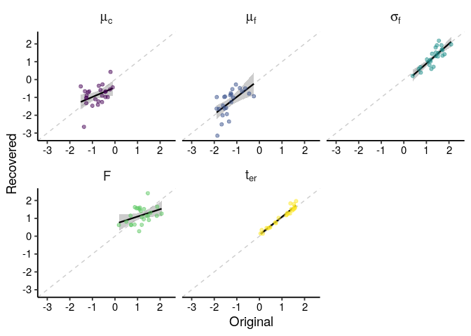<!-- -->

Alternative plot:

``` r
ggplot(s3_par_comp_plot, aes(x = original, y = recovered)) +
  facet_wrap(~ parameter, ncol = 5, labeller = labeller(parameter = label_parsed))+
  geom_abline(lty = 2, colour = "grey80") +
  geom_smooth(method = "lm", formula = y ~ x, alpha = .5, colour = "black", lwd = rel(.8)) +
  geom_point(aes(colour = parameter), alpha = .5) +
  coord_fixed() +
  labs(x = "Original",
         y = "Recovered",
         colour = NULL) +
  scale_x_continuous(limits = c(min(s3_par_comp$recovered), max(s3_par_comp$recovered))) +
  scale_colour_viridis_d() +
  guides(colour = FALSE) +
  theme_paper +
  theme_paper +
  theme(strip.background = element_blank(),
        strip.text = element_text(size = rel(1)))
```

    ## Warning: `guides(<scale> = FALSE)` is deprecated. Please use
    ## `guides(<scale> = "none")` instead.

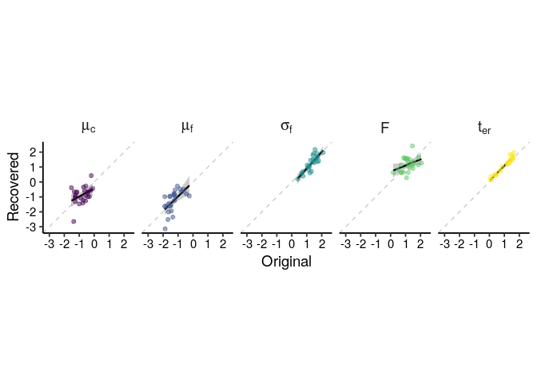<!-- -->

``` r
ggsave(file.path("..", "output", "param-recov-comparison.png"), width = 6.5, height = 3, dpi = 600)
```

Set axis limits by facet:

``` r
library(scales)
library(ggh4x)

par_limits <- s3_par_comp_plot %>%
  group_by(parameter) %>%
  summarise(limits = list(c(min(c(original, recovered)), max(c(original, recovered)))))

p_par_comp <- ggplot(s3_par_comp_plot, aes(x = original, y = recovered)) +
  facet_wrap(~ parameter, ncol = 7, scales = "free", labeller = labeller(parameter = label_parsed)) +
  geom_abline(lty = 2, colour = "grey80") +
  geom_smooth(method = "lm", formula = y ~ x, alpha = .2, colour = "black", lwd = rel(.8)) +
  geom_point(aes(colour = parameter), alpha = .9) +
  labs(x = "Original",
         y = "Recovered",
         colour = NULL) +
  facetted_pos_scales(
    x = list(
      scale_x_continuous(limits = par_limits$limits[[1]]),
      scale_x_continuous(limits = par_limits$limits[[2]]),
      scale_x_continuous(limits = par_limits$limits[[3]]),
      scale_x_continuous(limits = par_limits$limits[[4]]),
      scale_x_continuous(limits = par_limits$limits[[5]])
    ),
    y = list(
      scale_y_continuous(limits = par_limits$limits[[1]]),
      scale_y_continuous(limits = par_limits$limits[[2]]),
      scale_y_continuous(limits = par_limits$limits[[3]]),
      scale_y_continuous(limits = par_limits$limits[[4]]),
      scale_y_continuous(limits = par_limits$limits[[5]])
    )) +
  scale_colour_viridis_d() +
  guides(colour = FALSE) +
  theme_paper +
  theme_paper +
  theme(strip.background = element_blank(),
        strip.text = element_text(size = rel(1)),
        aspect.ratio = 1)
```

    ## Warning: `guides(<scale> = FALSE)` is deprecated. Please use
    ## `guides(<scale> = "none")` instead.

``` r
p_par_comp
```

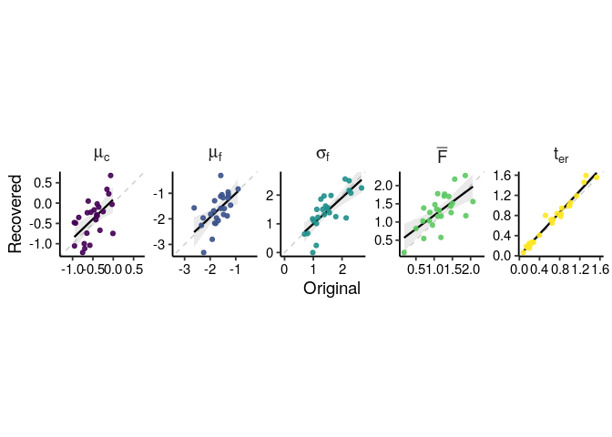<!-- -->

Compare fitted LBA density to data:

``` r
dlba_dat <- crossing(rt = seq(0, 20, by = .01),
         response = c(1, 2))

sim_lba <- s3_param_recov_best %>%
  split(.$participant) %>%
  future_map_dfr(function (x) {
    bind_cols(dlba_dat, density =
    dLBA(rt = dlba_dat$rt,
         response = dlba_dat$response,
         A = x$A,
         b = x$b,
         t0 = x$t0,
         meanlog_v = c(x$meanlog_v1, x$meanlog_v2),
         sdlog_v = c(1, x$sdlog_v2),
         distribution = "lnorm",
         silent = TRUE)) %>%
      mutate(participant = x$participant[1])
  }) %>%
  mutate(rt = ifelse(response == 1, rt, -rt),
         model = "LBA")
```

``` r
sim_actr %>%
  mutate(rt = ifelse(response == 1, rt, -rt),
         model = "Data") %>%
  ggplot(aes(x = rt, colour = model)) +
  facet_wrap(~ participant, ncol = 5) +
  geom_vline(xintercept = 0, lty = 2, colour = "grey80") +
  geom_histogram(aes(y = ..density..), binwidth = .5, colour = "black", fill = "white", size = .1) +
  geom_line(data = sim_lba, aes(y = density)) +
  scale_x_continuous(limits = c(-20, 20), breaks = c(-15, 0, 15)) +
  scale_y_continuous(expand = c(0, 0)) +
  scale_colour_manual(values = c("#e66101", "#5e3c99")) +
  labs(x = "RT (s)",
       y = "Density",
       colour = NULL) +
  guides(colour = FALSE) +
  theme_paper +
  theme(axis.ticks.y = element_blank(),
        axis.text.y = element_blank(),
        strip.background = element_blank(),
        strip.text = element_blank())
```

    ## Warning: `guides(<scale> = FALSE)` is deprecated. Please use
    ## `guides(<scale> = "none")` instead.

    ## Warning: Removed 14 rows containing non-finite values (stat_bin).

    ## Warning: Removed 50 rows containing missing values (geom_bar).

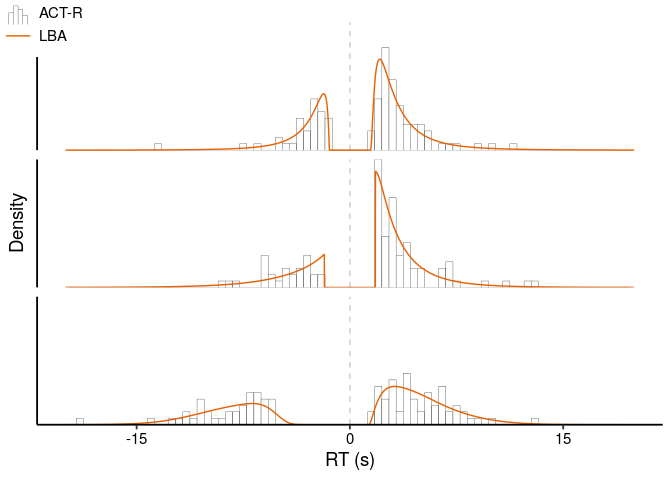<!-- -->

Alternative plot for presentation:

``` r
draw_key_custom <- function(data, params, size) {
  if(data$colour == "#000000" && data$size == .1) { # ACT-R
    grobTree(
      linesGrob(
        c(.1, .1, .3, .3, .3, .5, .5, .5, .7, .7, .7, .9, .9),
        c(0, .5, .5, 0, .8, .8, 0, .65, .65, 0, .4, .4, 0)
      ),
      gp = gpar(
        col = data$colour %||% "grey20",
        fill = alpha(data$fill %||% "white", data$alpha),
        lwd = (data$size %||% 0.5) * .pt,
        lty = data$linetype %||% 1
      )
    )
  } 
  else if (data$colour == "#e66101") { # LBA
    grobTree(
      linesGrob(
        c(0, 1),
        c(.5, .5)
      ),
      gp = gpar(
        col = alpha(data$colour %||% "grey20", data$alpha),
        fill = alpha(data$fill %||% "white", data$alpha),
        lwd = (data$size %||% 0.5) * .pt,
        lty = data$linetype %||% 1
      )
    )
  }
  else {
    grobTree() # Don't draw
  }
}


sim_actr %>%
  filter(participant <= 3) %>%
  mutate(rt = ifelse(response == 1, rt, -rt),
         model = "ACT-R") %>%
  ggplot(aes(x = rt, colour = model)) +
  facet_wrap(~ participant, ncol = 1) +
  geom_vline(xintercept = 0, lty = 2, colour = "grey80") +
  geom_histogram(aes(y = ..density..), binwidth = .5, fill = "white", size = .1, key_glyph = draw_key_custom) +
  geom_line(data = filter(sim_lba, participant <= 3), aes(y = density), key_glyph = draw_key_custom) +
  scale_x_continuous(limits = c(-20, 20), breaks = c(-15, 0, 15)) +
  scale_y_continuous(expand = c(0, 0)) +
  scale_colour_manual(values = c("#000000", "#e66101")) +
  labs(x = "RT (s)",
       y = "Density",
       colour = NULL) +
  theme_paper +
  theme(axis.ticks.y = element_blank(),
        axis.text.y = element_blank(),
        strip.background = element_blank(),
        strip.text = element_blank(),
        legend.position = "top",
        legend.justification = "left",
        legend.direction = "vertical",
        legend.box.margin = unit(c(-20, 0, -40, -30), "pt"))
```

    ## Warning: Removed 1 rows containing non-finite values (stat_bin).

    ## Warning: Removed 6 rows containing missing values.

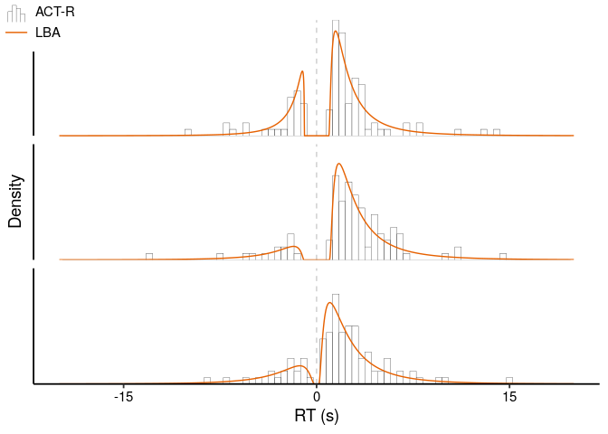<!-- -->

``` r
ggsave(file.path("..", "output", "param-recov-dist-comp.png"), width = 1.75, height = 3, dpi = 600)
```

    ## Warning: Removed 1 rows containing non-finite values (stat_bin).
    
    ## Warning: Removed 6 rows containing missing values.

Plot correlation between parameters:

``` r
library(GGally)

p_par_cor <- s3_par_comp_plot %>%
  select(-original) %>%
  pivot_wider(names_from = parameter, values_from = recovered) %>%
  select(participant, `mu[c]`, `mu[f]`, `sigma[f]`, `bar(F)`, `t[er]`) %>%
  ggpairs(columns = 2:6,
          labeller = "label_parsed",
          lower = list(continuous = wrap("smooth_lm", se = FALSE, alpha = .5)),
          upper = list(continuous = wrap("cor", display_grid = TRUE, digits = 2, stars = TRUE)),
          axisLabels = "show",
          switch = "both",
          progress = FALSE) +
  theme_paper +
  theme(strip.background = element_blank(),
        strip.placement = "outside",
        strip.text = element_text(size = rel(1)),
        strip.text.y.left = element_text(angle = 0),
        axis.text = element_blank())

p_par_cor
```

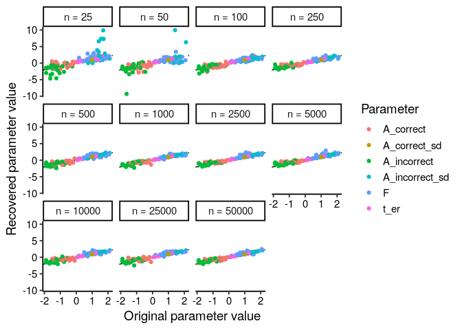<!-- -->

``` r
ggsave(file.path("..", "output", "param_recov_corr.pdf"), width = 4.5, height = 4.5)
```

# Simulation 4: multiple participants, vary dataset size

The previous simulation uses 100 trials per participant. How accurately
can we recover parameters from datasets of different sizes?

Use the same parameters as in Simulation 3:

``` r
n_participants <- 25

set.seed(2021)

# Latency factor F
lf <- rtrunc(n_participants, spec = "norm", mean = 1, sd = .5, a = 0, b = Inf)
lf_range <- rtrunc(n_participants, spec = "norm", mean = .1, sd = .05, a = 0, b = Inf)
lf_lower <- lf - .5 * lf_range
lf_upper <- lf + .5 * lf_range

# Non-retrieval time t_er
t_er <- rtrunc(n_participants, spec = "norm", mean = .75, sd = .5, a = 0, b = Inf)

# Activation of correct answer
a_c_mu <- rtrunc(n_participants, spec = "norm", mean = -.5, sd = .5, a = -Inf, b = 0)
a_c_sd <- rep(1, n_participants)

# Activation of incorrect answer
a_f_mu <- rtrunc(n_participants, spec = "norm", mean = -1.5, sd = .5, a = -Inf, b = 0)
a_f_sd <- rtrunc(n_participants, spec = "norm", mean = 1.5, sd = .5, a = 0, b = Inf)
```

Define dataset
sizes:

``` r
dataset_sizes <- c(25, 50, 250, 500, 1000, 2500, 5000, 10000, 25000, 50000)
```

Generate datasets of different sizes and recover the parameters:

``` r
if (use_cached_results) {

  s4_param_recov <- bind_rows(readRDS(file.path("..", "output", "s4_param_recov.rds")),
                              readRDS(file.path("..", "output", "s3_param_recov_best.rds")) %>%
                                mutate(dataset_size = 100))
    
} else {
  
  n_attempts <- 250
  s4_param_recov <- tibble()
  
  for(i in 1:length(dataset_sizes)) {
    
    # Generate dataset
    n_trials <- dataset_sizes[i]
    
    sim_actr <- tibble(participant = rep(1:n_participants, each = n_trials),
                       # f = rep(lf, each = n_trials),
                       f = runif(n_participants * n_trials, min = rep(lf_lower, each = n_trials), max = rep(lf_upper, each = n_trials)),
                       a_c = rnorm(n_participants * n_trials, mean = rep(a_c_mu, each = n_trials), sd = rep(a_c_sd, each = n_trials)),
                       a_f = rnorm(n_participants * n_trials, mean = rep(a_f_mu, each = n_trials), sd = rep(a_f_sd, each = n_trials)),
                       t = rep(t_er, each = n_trials)
    ) %>%
      rowwise() %>%
      mutate(rt = f * exp(-max(a_c, a_f)) + t,
             response = ifelse(a_c > a_f, 1, 2)) %>%
      ungroup()
    
    # Fit each participant separately
    sim_actr_split <- split(sim_actr, sim_actr$participant)
    
    s4_fit <- future_map_dfr(sim_actr_split, function(x) {
      
      # Run n_attempts times with different random starting values
      fit <- future_map_dfr(1:n_attempts, function(y) {
        recover_parameters(data = x, obj_fun = obj_fun)
      })
      
      # Keep the best fit
      fit %>%
        filter(objective == min(objective)) %>%
        slice(1) %>% # If there are multiple rows with the exact same value, only keep the first
        mutate(participant = x$participant[1])
      
    }) %>%
      mutate(dataset_size = dataset_sizes[i])
    
    saveRDS(s4_fit, file.path("..", "output", paste0("s4_param_recov_", dataset_sizes[i], ".rds")))
    
    s4_param_recov <- bind_rows(s4_param_recov, s4_fit)
    
  }
  
  saveRDS(s4_param_recov, file.path("..", "output", "s4_param_recov.rds"))
  
}
```

``` r
s4_param_recov_long <- s4_param_recov %>%
  transmute(
    n = dataset_size,
    participant,
    F_lower = b - A,
    F_upper = b,
    F = (b - A + b)/2,
    t_er = t0,
    A_correct = meanlog_v1,
    A_incorrect = meanlog_v2,
    A_correct_sd = 1,
    A_incorrect_sd = sdlog_v2
  ) %>%
  pivot_longer(F_lower:A_incorrect_sd, names_to = "parameter", values_to = "recovered")

s4_param_orig_long <- tibble(n = rep(c(dataset_sizes, 100), each = n_participants),
                             participant = rep(1:n_participants, length(dataset_sizes) + 1),
                             F_lower = rep(lf_lower, length(dataset_sizes) + 1),
                             F_upper = rep(lf_upper, length(dataset_sizes) + 1),
                             F = rep(lf, length(dataset_sizes) + 1),
                             t_er = rep(t_er, length(dataset_sizes) + 1),
                             A_correct = rep(a_c_mu, length(dataset_sizes) + 1),
                             A_incorrect = rep(a_f_mu, length(dataset_sizes) + 1),
                             A_correct_sd = rep(a_c_sd, length(dataset_sizes) + 1),
                             A_incorrect_sd = rep(a_f_sd, length(dataset_sizes) + 1)) %>%
  pivot_longer(F_lower:A_incorrect_sd, names_to = "parameter", values_to = "original")

s4_par_comp <- left_join(s4_param_recov_long, s4_param_orig_long, by = c("n", "participant", "parameter"))
```

Comparison of original ACT-R parameters to recovered parameter estimates
from the
LBA:

``` r
ggplot(s4_par_comp, aes(x = original, y = recovered, colour = parameter)) +
  facet_wrap(~ n, labeller = function(x) label_both(labels = x, sep = " = ")) +
  geom_abline(lty = 2) +
  geom_point() +
  labs(x = "Original parameter value",
         y = "Recovered parameter value",
         colour = "Parameter") +
  theme_paper
```

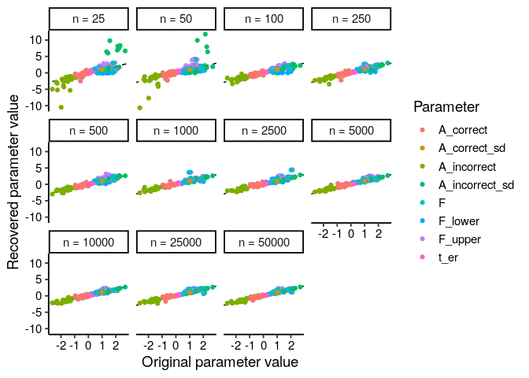<!-- -->

Difference between the original ACT-R parameters and the recovered
parameter estimates from the LBA, as a function of datset size:

``` r
s4_par_comp_error <- s4_par_comp %>%
  filter(parameter != "A_correct_sd") %>%
  mutate(parameter = factor(parameter, 
                            levels = c("A_correct", "A_incorrect", "A_incorrect_sd", "F_lower", "F_upper", "F", "t_er"),
                            labels  = c(expression(mu[c]), expression(mu[f]), expression(sigma[f]), expression(F[a]), expression(F[b]), expression(bar(F)), expression(t[er])))) %>%
  filter(!parameter %in% c("F[a]", "F[b]")) %>%
  rowwise() %>%
  mutate(ae = abs(original - recovered)) %>%
  ungroup()

s4_par_comp_error_param <- s4_par_comp_error %>%
  group_by(n, parameter) %>%
  summarise(mae = mean(ae))
```

    ## `summarise()` has grouped output by 'n'. You can override using the `.groups` argument.

``` r
s4_par_comp_error_mean <- s4_par_comp_error %>%
  group_by(n, parameter) %>%
  summarise(mae = mean(ae)) %>%
  group_by(n) %>%
  summarise(mae = mean(mae))
```

    ## `summarise()` has grouped output by 'n'. You can override using the `.groups` argument.

``` r
p_par_comp_multi_error <- ggplot() +
  geom_rect(aes(xmin = exp(log(100) - .25), xmax = exp(log(100) + .25), ymin = 0, ymax = 2.05), colour = NA, fill = "grey90") +
  geom_jitter(data = s4_par_comp_error, aes(x = n, y = ae, colour = parameter), height = 0, width = .025, alpha = .05) +
  geom_line(data = s4_par_comp_error_param, aes(x = n, y = mae, group = parameter, colour = parameter), lty = 2) +
  geom_point(data = s4_par_comp_error_param, aes(x = n, y = mae, group = parameter, colour = parameter, pch = parameter), alpha = .9) +
  geom_line(data = s4_par_comp_error_mean, aes(x = n, y = mae), lty = 2, lwd = rel(.85)) +
  geom_point(data = s4_par_comp_error_mean, aes(x = n, y = mae), size = rel(2)) +
  scale_x_log10(breaks = c(25, 50, 100, 250, 500, 1000, 2500, 5000, 10000, 25000, 50000),
                labels = c(25, 50, 100, 250, 500, "1K", "2.5K", "5K", "10K", "25K", "50K")) +
  scale_y_continuous(expand = expansion(0, c(0, .05))) +
  scale_colour_viridis_d(labels = scales::parse_format()) +
  scale_shape_manual(labels = scales::parse_format(), values = c(15, 0, 17, 6, 19)) +
  coord_cartesian(ylim = c(0, 2)) +
  labs(x = "Number of trials",
       y = "Absolute error",
       colour = NULL,
       pch = NULL) +
  theme_paper +
  theme(axis.text.x = element_text(face = c("plain", "plain", "bold", "plain", "plain", "plain", "plain", "plain", "plain", "plain", "plain")),
        legend.background = element_blank(),
        legend.direction = "horizontal",
        legend.position = "top",
        legend.justification = "right",
        legend.box.margin = unit(c(0, 0, -40, 0), "pt"))
```

    ## Warning: Vectorized input to `element_text()` is not officially supported.
    ## Results may be unexpected or may change in future versions of ggplot2.

``` r
p_par_comp_multi_error
```

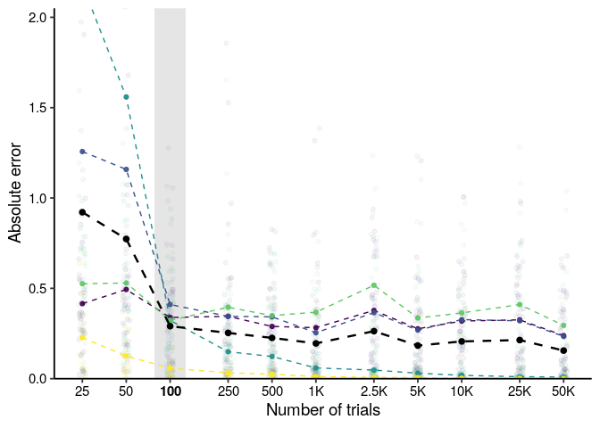<!-- -->

Make version with colour legend for presentation:

``` r
ggplot() +
  geom_rect(aes(xmin = exp(log(100) - .25), xmax = exp(log(100) + .25), ymin = 0, ymax = 2), colour = NA, fill = "grey90") +
  geom_jitter(data = s4_par_comp_error, aes(x = n, y = ae, colour = parameter), height = 0, width = .025, alpha = .05) +
  geom_line(data = s4_par_comp_error_param, aes(x = n, y = mae, group = parameter, colour = parameter), lty = 2) +
  geom_point(data = s4_par_comp_error_param, aes(x = n, y = mae, group = parameter, colour = parameter), alpha = .9) +
  geom_line(data = s4_par_comp_error_mean, aes(x = n, y = mae), lty = 2, lwd = rel(.85)) +
  geom_point(data = s4_par_comp_error_mean, aes(x = n, y = mae), size = rel(2)) +
  scale_x_log10(breaks = c(25, 50, 100, 250, 500, 1000, 2500, 5000, 10000, 25000, 50000),
                labels = c(25, 50, 100, 250, 500, "1K", "2.5K", "5K", "10K", "25K", "50K")) +
  scale_y_continuous(expand = c(0, 0)) +
  scale_colour_viridis_d(labels = scales::parse_format()) +
  coord_cartesian(ylim = c(0, 2)) +
  labs(x = "Number of trials",
       y = "Absolute error",
       colour = NULL) +
  theme_paper +
  theme(axis.text.x = element_text(face = c("plain", "plain", "bold", "plain", "plain", "plain", "plain", "plain", "plain", "plain", "plain")),
        legend.background = element_blank(),
        legend.direction = "horizontal",
        legend.position = "top",
        legend.justification = "right",
        legend.box.margin = unit(c(0, 0, -40, 0), "pt"))
```

    ## Warning: Vectorized input to `element_text()` is not officially supported.
    ## Results may be unexpected or may change in future versions of ggplot2.

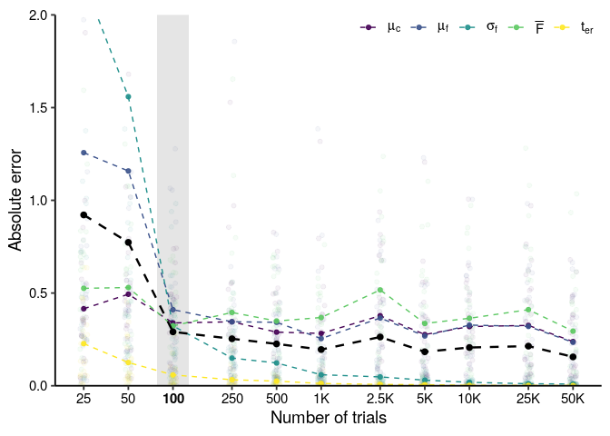<!-- -->

``` r
ggsave(file.path("..", "output", "param-recov-multi-error.png"), width = 6, height = 3, dpi = 600)
```

Make the figure in the paper:

``` r
plot_grid(p_par_comp, p_par_comp_multi_error,
          align = "hv",
          axis = "tblr",
          labels = c("A", "B"))
```

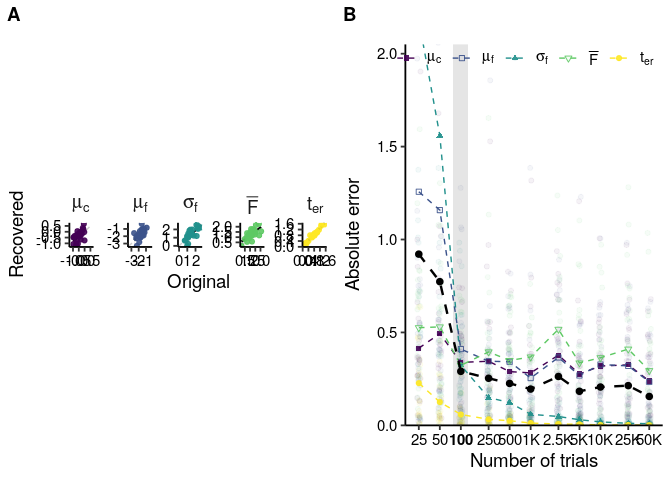<!-- -->

``` r
ggsave(file.path("..", "output", "param_recov_multi_combi.pdf"), width = 9, height = 4.5)
```

Also calculate correlation between original and recovered parameter
values:

``` r
s4_par_comp_cor <- s4_par_comp %>%
  filter(parameter != "A_correct_sd") %>%
  mutate(parameter = factor(parameter, 
                            levels = c("A_correct", "A_incorrect", "A_incorrect_sd", "F_lower", "F_upper", "F", "t_er"),
                            labels  = c(expression(mu[c]), expression(mu[f]), expression(sigma[f]), expression(F[a]), expression(F[b]), expression(F), expression(t[er])))) %>%
  filter(!parameter %in% c("F[a]", "F[b]")) %>%
  group_by(n, parameter) %>%
  summarise(r = cor(original, recovered, method = "pearson"))
```

    ## `summarise()` has grouped output by 'n'. You can override using the `.groups` argument.

``` r
s4_par_comp_cor_mean <- s4_par_comp_cor %>%
  group_by(n) %>%
  summarise(r = mean(r))

p_par_comp_multi_cor <- ggplot(s4_par_comp_cor, aes(x = n, y = r)) +
  geom_rect(aes(xmin = exp(log(100) - .25), xmax = exp(log(100) + .25), ymin = 0, ymax = 1.05), colour = NA, fill = "grey90") +
  geom_line(aes(group = parameter, colour = parameter), lty = 2) +
  geom_point(aes(group = parameter, colour = parameter, shape = parameter), alpha = .9) +
  geom_line(data = s4_par_comp_cor_mean, lty = 2, lwd = rel(.85)) +
  geom_point(data = s4_par_comp_cor_mean, size = rel(2)) +
  scale_x_log10(breaks = c(25, 50, 100, 250, 500, 1000, 2500, 5000, 10000, 25000, 50000),
                labels = c(25, 50, 100, 250, 500, "1K", "2.5K", "5K", "10K", "25K", "50K")) +
  scale_y_continuous(breaks = seq(0, 1, by = .2), expand = expansion(0, c(0, .05))) +
  scale_colour_viridis_d() +
  scale_shape_manual(labels = scales::parse_format(), values = c(15, 0, 17, 6, 19)) +
  coord_cartesian(ylim = c(0, 1)) +
  labs(x = "Number of trials",
       y = "Correlation") +
  guides(colour = FALSE,
         shape = FALSE) +
  theme_paper +
  theme(axis.text.x = element_text(face = c("plain", "plain", "bold", "plain", "plain", "plain", "plain", "plain", "plain", "plain", "plain")))
```

    ## Warning: `guides(<scale> = FALSE)` is deprecated. Please use
    ## `guides(<scale> = "none")` instead.

    ## Warning: Vectorized input to `element_text()` is not officially supported.
    ## Results may be unexpected or may change in future versions of ggplot2.

``` r
p_par_comp_multi_cor
```

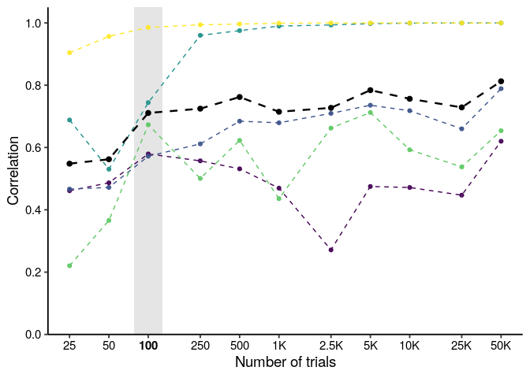<!-- -->

Plot correlation between the recovered parameters in the 50K trials
case:

``` r
p_par_cor <- s4_par_comp %>%
  filter(n == 50000) %>%
  filter(parameter != "A_correct_sd") %>%
  mutate(parameter = factor(parameter, 
                            levels = c("A_correct", "A_incorrect", "A_incorrect_sd", "F_lower", "F_upper", "F", "t_er"),
                            labels  = c(expression(mu[c]), expression(mu[f]), expression(sigma[f]), expression(F[a]), expression(F[b]), expression(bar(F)), expression(t[er])))) %>%
  filter(!parameter %in% c("F[a]", "F[b]")) %>%
  select(-original) %>%
  pivot_wider(names_from = parameter, values_from = recovered) %>%
  select(participant, `mu[c]`, `mu[f]`, `sigma[f]`, `bar(F)`, `t[er]`) %>%
  ggpairs(columns = 2:6,
          labeller = "label_parsed",
          lower = list(continuous = wrap("smooth_lm", se = FALSE, alpha = .5)),
          upper = list(continuous = wrap("cor", display_grid = TRUE, digits = 2, stars = TRUE)),
          axisLabels = "show",
          switch = "both",
          progress = FALSE) +
  theme_paper +
  theme(strip.background = element_blank(),
        strip.placement = "outside",
        strip.text = element_text(size = rel(1)),
        strip.text.y.left = element_text(angle = 0),
        axis.text = element_blank())

p_par_cor
```

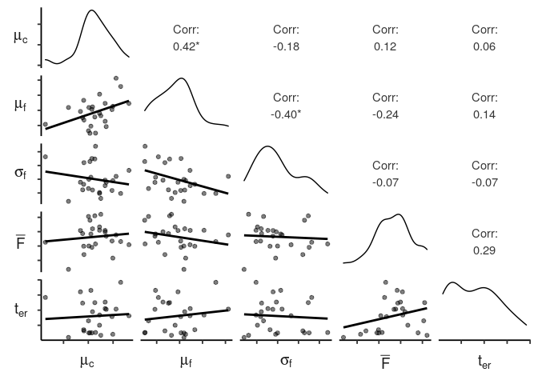<!-- -->

``` r
ggsave(file.path("..", "output", "param_recov_corr.pdf"), width = 4.5, height = 4.5)
```

Make the figure in the extended paper, which includes correlation
alongside absolute error:

``` r
plot_grid(p_par_comp,
          plot_grid(
            p_par_comp_multi_error,
            p_par_comp_multi_cor,
            labels = c("B", "C"),
            align = "v",
            axis = "tb"
          ),
          ncol = 1,
          labels = c("A"),
          align = "h",
          axis = "lr")
```

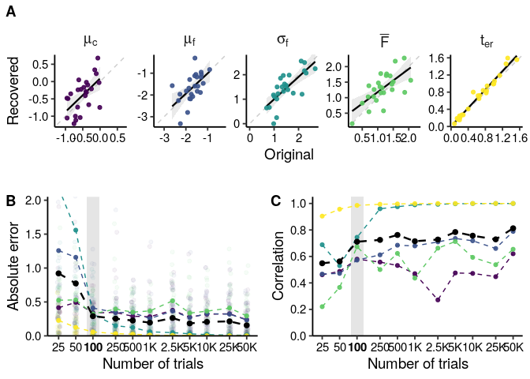<!-- -->

``` r
ggsave(file.path("..", "output", "param_recov_multi_combi_2.pdf"), width = 9, height = 4.5)
```

Add between-parameter correlation:

``` r
plot_grid(p_par_comp,
          plot_grid(
                    plot_grid(
                      p_par_comp_multi_error,
                      p_par_comp_multi_cor,
                      ncol = 1,
                      labels = c("B", "C"),
                      align = "h",
                      axis = "lr"),
                    ggmatrix_gtable(p_par_cor),
                    ncol = 2,
                    labels = c("", "D"),
                    align = "v",
                    axis = "tb"
            ),
          ncol = 1,
          labels = c("A"),
          align = "h",
          axis = "lr",
          rel_heights = c(.6, 1)
          )
```

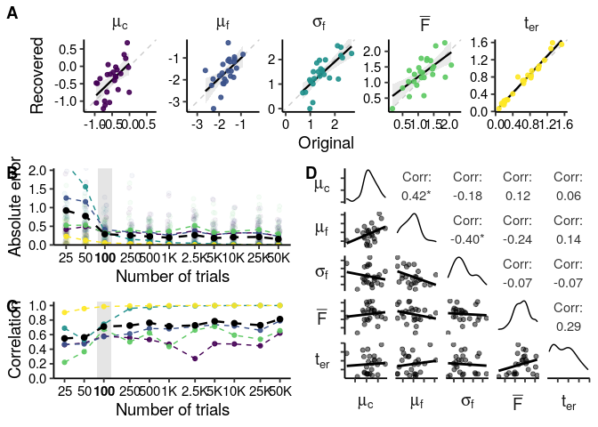<!-- -->

``` r
ggsave(file.path("..", "output", "param_recov_multi_combi_3.pdf"), width = 9, height = 7.5)
```

# Session info

``` r
sessionInfo()
```

    ## R version 3.6.3 (2020-02-29)
    ## Platform: x86_64-pc-linux-gnu (64-bit)
    ## Running under: Ubuntu 18.04.6 LTS
    ## 
    ## Matrix products: default
    ## BLAS:   /usr/lib/x86_64-linux-gnu/blas/libblas.so.3.7.1
    ## LAPACK: /usr/lib/x86_64-linux-gnu/lapack/liblapack.so.3.7.1
    ## 
    ## locale:
    ##  [1] LC_CTYPE=en_US.UTF-8       LC_NUMERIC=C              
    ##  [3] LC_TIME=nl_NL.UTF-8        LC_COLLATE=en_US.UTF-8    
    ##  [5] LC_MONETARY=nl_NL.UTF-8    LC_MESSAGES=en_US.UTF-8   
    ##  [7] LC_PAPER=nl_NL.UTF-8       LC_NAME=C                 
    ##  [9] LC_ADDRESS=C               LC_TELEPHONE=C            
    ## [11] LC_MEASUREMENT=nl_NL.UTF-8 LC_IDENTIFICATION=C       
    ## 
    ## attached base packages:
    ## [1] grid      stats4    stats     graphics  grDevices utils     datasets 
    ## [8] methods   base     
    ## 
    ## other attached packages:
    ##  [1] GGally_2.1.2    ggh4x_0.2.0     scales_1.1.1    rlang_0.4.10   
    ##  [5] cowplot_0.9.4   truncdist_1.0-2 evd_2.3-3       tidyr_1.0.0    
    ##  [9] furrr_0.1.0     future_1.13.0   purrr_0.3.2     rtdists_0.11-2 
    ## [13] ggplot2_3.3.5   dplyr_1.0.7    
    ## 
    ## loaded via a namespace (and not attached):
    ##  [1] tidyselect_1.1.1   xfun_0.21          listenv_0.7.0     
    ##  [4] splines_3.6.3      lattice_0.20-41    colorspace_1.4-1  
    ##  [7] vctrs_0.3.8        generics_0.1.0     expm_0.999-4      
    ## [10] viridisLite_0.3.0  htmltools_0.3.6    mgcv_1.8-28       
    ## [13] yaml_2.2.0         utf8_1.1.4         survival_2.44-1.1 
    ## [16] pillar_1.6.3       glue_1.4.2         withr_2.3.0       
    ## [19] DBI_1.1.0          RColorBrewer_1.1-2 plyr_1.8.4        
    ## [22] lifecycle_1.0.1    stringr_1.4.0      munsell_0.5.0     
    ## [25] gtable_0.3.0       mvtnorm_1.1-1      codetools_0.2-16  
    ## [28] evaluate_0.14      labeling_0.3       knitr_1.23        
    ## [31] parallel_3.6.3     fansi_0.4.0        Rcpp_1.0.6        
    ## [34] jsonlite_1.6       farver_2.1.0       digest_0.6.19     
    ## [37] stringi_1.4.3      msm_1.6.8          gsl_2.1-6         
    ## [40] tools_3.6.3        magrittr_2.0.1     tibble_2.1.3      
    ## [43] crayon_1.4.1       pkgconfig_2.0.2    ellipsis_0.3.2    
    ## [46] Matrix_1.2-18      reshape_0.8.8      rmarkdown_2.6     
    ## [49] R6_2.4.0           globals_0.12.4     nlme_3.1-149      
    ## [52] compiler_3.6.3
