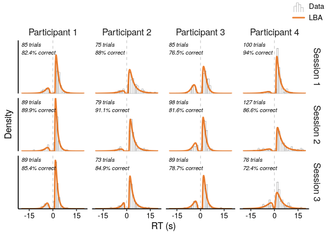
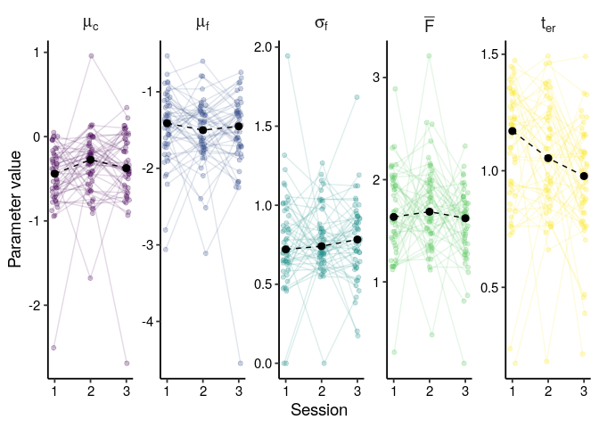

Example Application: Modelling Changing Retrieval Performance in
Empirical Data
================
Maarten van der Velde
Last updated: 2021-06-21

# Overview

In this analysis, we model changes in retrieval performance between
three retrieval practice sessions. First, we analyse behavioural
measures (RT and accuracy). Then. we fit the LBA to the data, convert
the resulting LBA parameters to ACT-R parameters, and analyse those
parameter estimates.

# Setup

``` r
library(dplyr)
library(ggplot2)
library(rtdists)
library(purrr)
library(furrr)
library(tidyr)
library(truncdist)
library(cowplot)
library(grid)
library(rlang)
library(lme4)
library(lmerTest)

future::plan("multiprocess", workers = 4) # Set to desired number of cores

theme_paper <- theme_classic(base_size = 14) + 
  theme(axis.text = element_text(colour = "black"))


use_cached_results <- TRUE # Set to FALSE to rerun simulations (takes time!)

set.seed(2021)
```

## Parameter recovery functions

Define the objective function to minimise (adapted to lognormal
distribution from the [rtdists
example](https://github.com/rtdists/rtdists/blob/master/examples/examples.lba.R)):

``` r
obj_fun <- function(par, rt, response, distribution = "lnorm") {
  # simple parameters
  spar <- par[!grepl("[12]$", names(par))]  
  
  # distribution parameters:
  dist_par_names <- unique(sub("[12]$", "", grep("[12]$" ,names(par), value = TRUE)))
  dist_par <- vector("list", length = length(dist_par_names))
  names(dist_par) <- dist_par_names
  for (i in dist_par_names) dist_par[[i]] <- as.list(unname(par[grep(i, names(par))]))
  dist_par$sdlog_v <- c(1, dist_par$sdlog_v) # fix first sdlog_v to 1

  # get summed log-likelihood:
  d <- do.call(dLBA, args = c(rt=list(rt), response=list(response), spar, dist_par, 
                               distribution=distribution, silent=TRUE))
  if (any(d < 0e-10)) return(1e6) 
  else return(-sum(log(d)))
}
```

Define the parameter recovery function, which randomly initialises the
LBA parameters (within some reasonable constraints to promote
convergence) and then uses the nlminb optimiser to find the best fit,
evaluating each iteration with the objective function:

``` r
recover_parameters <- function(data, obj_fun) {
  
  # Generate random starting values
  init_par <- runif(6)
  init_par[2] <- init_par[2] + 1 # Ensure b is larger than A
  init_par[3] <- runif(1, 0, min(data$rt)) # Ensure t0 is mot too large
  init_par[4] <- -init_par[4] # Ensure meanlog_v1 is negative
  init_par[5] <- init_par[4] - init_par[5] # Ensure meanlog_v2 is negative and lower than meanlog_v2
  names(init_par) <- c("A", "b", "t0", "meanlog_v1", "meanlog_v2", "sdlog_v2")
  
  # Run optimiser
  fit <- nlminb(obj_fun,
                start = init_par, 
                rt = data$rt, response = data$response,
                lower = c(0, 0, 0, -Inf, -Inf, 0)) # Set lower bounds on parameters
  
  # Only keep parameter estimates if the optimiser converged successfully
  if (fit$convergence == 0 && !is.infinite(fit$objective)) {
    return(as.list(c(fit$par, objective = fit$objective)))
  }
  
  return(NULL)
  
}
```

## Prepare data

We’ll clean the data by removing study trials, trials in which no
response was recorded, and trials with an RT lower than 300 ms. To give
the model a chance of fitting the RT distributions, we’ll also require
that participants completed at least 50 trials and made at least 5
errors in each of the three sessions.

``` r
d <- read.csv(file.path("..", "data", "data.csv")) %>%
  filter(study == FALSE,
         !is.infinite(rt),
         rt >= 300) %>%
  transmute(participant = as.character(subject),
            list = case_when( # Simplify list names
              list == "2019-09_1" ~ 1,
              list == "2019-09_2" ~ 2,
              list == "2019-09_3" ~ 3,
              list == "2021-03_1" ~ 1,
              list == "2021-03_2" ~ 2,
              list == "2021-03_3" ~ 3
            ),
            trial_index,
            rt = rt / 1000,
            response = ifelse(correct == TRUE, 1, 2)
  )

# Total number of participants
length(unique(d$participant))
```

    ## [1] 127

``` r
# Full dataset size
nrow(d)
```

    ## [1] 29441

``` r
min_trials <- 50
min_errors <- 5

d <- d %>%
  group_by(participant, list) %>%
  filter(n() > min_trials) %>%
  filter(length(response[response == 2]) > min_errors) %>%
  group_by(participant) %>%
  filter(length(unique(list)) == 3)

# Number of included participants
length(unique(d$participant))
```

    ## [1] 50

``` r
# Number of included trials
nrow(d)
```

    ## [1] 12568

Number of trials per participant, per list:

``` r
d %>%
  group_by(participant, list) %>%
  tally() %>%
  pull(n) %>%
  summary()
```

    ##    Min. 1st Qu.  Median    Mean 3rd Qu.    Max. 
    ##   53.00   75.00   83.00   83.79   91.00  139.00

# Behavioural results

Plot accuracy and RT on correct responses:

``` r
p_acc <- d %>%
  mutate(correct = response == 1) %>%
  group_by(participant, list) %>%
  summarise(accuracy = mean(correct)) %>%
  mutate(list_jitter = jitter(list, .4)) %>%
  ggplot(aes(x = list_jitter, y = accuracy, group = participant)) +
  geom_line(colour = "#78B7C5", alpha = .25) +
  geom_point(colour = "#3B9AB2", alpha = .8, size = .8) +
  geom_boxplot(aes(x = list, group = list), width = .2, colour = "black", outlier.shape = NA, fill = NA) +
  scale_x_continuous(breaks = c(1, 2, 3)) +
  scale_y_continuous(limits = c(.4, 1), labels = scales::percent_format(accuracy = 1)) +
  labs(x = "Session",
       y = NULL,
       title = "Accuracy") +
  guides(colour = FALSE) +
  theme_paper +
  theme(plot.title = element_text(hjust = .5, size = rel(1)))

p_acc
```

<!-- -->

``` r
p_rt <- d %>%
  filter(response == 1) %>%
  group_by(participant, list) %>%
  summarise(rt = median(rt)) %>%
  mutate(list_jitter = jitter(list, .4)) %>%
  ggplot(aes(x = list_jitter, y = rt, group = participant)) +
  geom_line(colour = "#78B7C5", alpha = .25) +
  geom_point(colour = "#3B9AB2", alpha = .8, size = .8) +
  geom_boxplot(aes(x = list, group = list), width = .2, colour = "black", outlier.shape = NA, fill = NA) +
  scale_x_continuous(breaks = c(1, 2, 3)) +
  scale_y_continuous(limits = c(1.75, 5)) +
  labs(x = "Session",
       y = NULL,
       title = "RT (s)") +
  guides(colour = FALSE) +
  theme_paper +
  theme(plot.title = element_text(hjust = .5, size = rel(1)))

p_rt
```

<!-- -->

``` r
plot_grid(p_acc, p_rt,
          align = "hv",
          axis = "tblr",
          labels = "AUTO")
```

<!-- -->

``` r
ggsave(file.path("..", "output", "real_data.pdf"), width = 4.5, height = 3)
```

Presentation version:

``` r
plot_grid(p_acc, p_rt,
          align = "hv",
          axis = "tblr")
```

<!-- -->

``` r
ggsave(file.path("..", "output", "real_data.png"), width = 4.5, height = 3, dpi = 600)
```

Do accuracy and RT change from session to session?

``` r
m_acc <- glmer(correct ~ session + (1 | participant),
               data = mutate(d, 
                             correct = response == 1,
                             session = factor(list, levels = c(2, 1, 3))),
               family = binomial)

summary(m_acc)
```

    ## Generalized linear mixed model fit by maximum likelihood (Laplace
    ##   Approximation) [glmerMod]
    ##  Family: binomial  ( logit )
    ## Formula: correct ~ session + (1 | participant)
    ##    Data: 
    ## mutate(d, correct = response == 1, session = factor(list, levels = c(2,  
    ##     1, 3)))
    ## 
    ##      AIC      BIC   logLik deviance df.resid 
    ##  11668.7  11698.5  -5830.4  11660.7    12564 
    ## 
    ## Scaled residuals: 
    ##     Min      1Q  Median      3Q     Max 
    ## -3.7770  0.3435  0.4161  0.4876  0.9334 
    ## 
    ## Random effects:
    ##  Groups      Name        Variance Std.Dev.
    ##  participant (Intercept) 0.2181   0.467   
    ## Number of obs: 12568, groups:  participant, 50
    ## 
    ## Fixed effects:
    ##             Estimate Std. Error z value Pr(>|z|)    
    ## (Intercept)  1.63542    0.07854  20.822  < 2e-16 ***
    ## session1    -0.26991    0.05767  -4.680 2.87e-06 ***
    ## session3    -0.01479    0.05851  -0.253      0.8    
    ## ---
    ## Signif. codes:  0 '***' 0.001 '**' 0.01 '*' 0.05 '.' 0.1 ' ' 1
    ## 
    ## Correlation of Fixed Effects:
    ##          (Intr) sessn1
    ## session1 -0.391       
    ## session3 -0.385  0.525

Yes, accuracy increases from session 1 to session 2, but there’s no
evidence of change from session 2 to session 3.

``` r
m_rt <- glmer(rt ~ session + (1 | participant),
              data = filter(mutate(d, session = factor(list, levels = c(2, 1, 3))), response == 1),
              family = Gamma(link = "identity"))

summary(m_rt)
```

    ## Generalized linear mixed model fit by maximum likelihood (Laplace
    ##   Approximation) [glmerMod]
    ##  Family: Gamma  ( identity )
    ## Formula: rt ~ session + (1 | participant)
    ##    Data: filter(mutate(d, session = factor(list, levels = c(2, 1, 3))),  
    ##     response == 1)
    ## 
    ##      AIC      BIC   logLik deviance df.resid 
    ##  39353.6  39389.8 -19671.8  39343.6    10251 
    ## 
    ## Scaled residuals: 
    ##     Min      1Q  Median      3Q     Max 
    ## -1.4488 -0.6250 -0.2707  0.3070 11.0826 
    ## 
    ## Random effects:
    ##  Groups      Name        Variance Std.Dev.
    ##  participant (Intercept) 0.1508   0.3883  
    ##  Residual                0.3978   0.6307  
    ## Number of obs: 10256, groups:  participant, 50
    ## 
    ## Fixed effects:
    ##             Estimate Std. Error t value Pr(>|z|)    
    ## (Intercept)  3.65999    0.08410  43.517  < 2e-16 ***
    ## session1     0.10266    0.04563   2.250   0.0244 *  
    ## session3    -0.29717    0.04138  -7.182 6.87e-13 ***
    ## ---
    ## Signif. codes:  0 '***' 0.001 '**' 0.01 '*' 0.05 '.' 0.1 ' ' 1
    ## 
    ## Correlation of Fixed Effects:
    ##          (Intr) sessn1
    ## session1 -0.253       
    ## session3 -0.276  0.513

Correct RT decreases from session 1 to session 2, and from session 2 to
session 3.

# Infer parameters from data

``` r
lists <- unique(d$list)
participants <- unique(d$participant)

if (use_cached_results) {
  
  param_infer_best <- readRDS(file.path("..", "output", "param_infer_best.rds"))
  
} else {
  
  n_attempts <- 250
  param_infer <- list()
  
  for(i in 1:length(participants)) {
    for(j in 1:length(lists)) {
      param_infer <- append(param_infer,
                            list(future_map_dfr(1:n_attempts, function(x) {
                              recover_parameters(data = filter(d,
                                                               participant == participants[i],
                                                               list == lists[j]),
                                                 obj_fun = obj_fun)
                            }) %>%
                              mutate(participant = participants[i],
                                     list = lists[j])
                            )
      )
    }
  }
  
  param_infer <- bind_rows(param_infer)
  
  saveRDS(param_infer, file.path("..", "output", "param_infer.rds"))
  
  # Only keep the best fit across all attempts, which is closest to the global optimum:
  param_infer_best <- param_infer %>%
    group_by(participant, list) %>%
    filter(objective == min(objective)) %>%
    slice(n()) %>% # If there are multiple rows with the exact same value, only keep the first
    ungroup()

  saveRDS(param_infer_best, file.path("..", "output", "param_infer_best.rds"))
  
  
}
```

``` r
dlba_dat <- crossing(participant = participants,
                     list = lists,
                     rt = seq(0, 20, by = .1),
                     response = c(1, 2))

sim_lba <- param_infer_best %>%
  split(list(.$participant, .$list), drop = TRUE) %>%
  future_map_dfr(function (x) {
    bind_cols(filter(dlba_dat, participant == x$participant, list == x$list),
              density = dLBA(rt = filter(dlba_dat, participant == x$participant, list == x$list)$rt,
                             response = filter(dlba_dat, participant == x$participant, list == x$list)$response,
                             A = x$A,
                             b = x$b,
                             t0 = x$t0,
                             meanlog_v = c(x$meanlog_v1, x$meanlog_v2),
                             sdlog_v = c(1, x$sdlog_v2),
                             distribution = "lnorm",
                             silent = TRUE))
  }) %>%
  mutate(rt = ifelse(response == 1, rt, -rt),
         model = "LBA")
```

## Visualise fit

Plot LBA best fit over the distribution of the data from four
participants:

``` r
# Randomly sample 4 participants
set.seed(2021)
participant_sample <- sample(participants, 4)

d_sample <- filter(d, participant %in% participant_sample)
sim_lba_sample <- filter(sim_lba, participant %in% participant_sample)

d_sample$participant <- factor(d_sample$participant, levels = participant_sample, labels = c("Participant 1", "Participant 2", "Participant 3", "Participant 4"))
sim_lba_sample$participant <- factor(sim_lba_sample$participant, levels = participant_sample, labels = c("Participant 1", "Participant 2", "Participant 3", "Participant 4"))

d_sample$list <- factor(d_sample$list, levels = c(1, 2, 3), labels = c("Session 1", "Session 2", "Session 3"))
sim_lba_sample$list <- factor(sim_lba_sample$list, levels = c(1, 2, 3), labels = c("Session 1", "Session 2", "Session 3"))


trial_counts <- d_sample %>%
  group_by(participant, list, response) %>%
  summarise(n = n()) %>%
  group_by(participant, list) %>%
  summarise(accuracy = n[response == 1]/sum(n),
            n = sum(n)) %>%
  mutate(label = paste0(n, " trials\n", prettyNum(accuracy*100, digits = 3), "% correct"))


draw_key_custom <- function(data, params, size) {
  if(data$colour == "#000000" && data$size == .1) { # Data
    grobTree(
      linesGrob(
        c(.1, .1, .3, .3, .3, .5, .5, .5, .7, .7, .7, .9, .9),
        c(0, .5, .5, 0, .8, .8, 0, .65, .65, 0, .4, .4, 0)
      ),
      gp = gpar(
        col = data$colour %||% "grey20",
        fill = alpha(data$fill %||% "white", data$alpha),
        lwd = (data$size %||% 0.5) * .pt,
        lty = data$linetype %||% 1
      )
    )
  } 
  else if (data$colour == "#e66101" && data$size == 1.1) { # LBA
    grobTree(
      linesGrob(
        c(0, 1),
        c(.5, .5)
      ),
      gp = gpar(
        col = alpha(data$colour %||% "grey20", data$alpha),
        fill = alpha(data$fill %||% "white", data$alpha),
        lwd = (data$size %||% 0.5) * .pt,
        lty = data$linetype %||% 1
      )
    )
  }
  else {
    grobTree() # Don't draw
  }
}


d_sample %>%
  mutate(rt = ifelse(response == 1, rt, -rt),
         model = "Data") %>%
  ggplot(aes(x = rt, colour = model)) +
  facet_grid(list ~ participant, drop = TRUE) +
  geom_vline(xintercept = 0, lty = 2, colour = "grey80") +
  geom_histogram(aes(y = ..density..), binwidth = 1, fill = "white", size = .1, key_glyph = draw_key_custom) +
  geom_line(data = sim_lba_sample, aes(y = density), size = rel(1.1), alpha = .8, key_glyph = draw_key_custom) +
  geom_text(data = trial_counts, aes(label = label), x = -20, y = .4, hjust = 0, colour = "black", size = rel(3), fontface = "italic") +
  scale_x_continuous(limits = c(-20, 20), breaks = c(-15, 0, 15)) +
  scale_y_continuous(expand = c(0, 0)) +
  scale_colour_manual(values = c("#000000", "#e66101")) +
  labs(x = "RT (s)",
       y = "Density",
       colour = NULL) +
  theme_paper +
  theme(axis.ticks.y = element_blank(),
        axis.text.y = element_blank(),
        strip.background = element_blank(),
        strip.text = element_text(size = rel(1)),
        legend.background = element_blank(),
        legend.position = "top",
        legend.justification = "right",
        legend.direction = "vertical",
        legend.box.margin = unit(c(-20, -30, -20, 0), "pt"))
```

    ## Warning: Removed 3 rows containing non-finite values (stat_bin).

    ## Warning: Removed 24 rows containing missing values.

<!-- -->

``` r
ggsave(file.path("..", "output", "param_recov_real_dist.pdf"), width = 9, height = 5)
```

    ## Warning: Removed 3 rows containing non-finite values (stat_bin).
    
    ## Warning: Removed 24 rows containing missing values.

``` r
ggsave(file.path("..", "output", "param_recov_real_dist.png"), width = 6.5, height = 4.25, dpi = 600)
```

    ## Warning: Removed 3 rows containing non-finite values (stat_bin).
    
    ## Warning: Removed 24 rows containing missing values.

Also make a smaller version for poster:

``` r
# Randomly sample 3 participants
set.seed(2020)
participant_sample <- sample(participants, 3)

d_sample <- filter(d, participant %in% participant_sample)
sim_lba_sample <- filter(sim_lba, participant %in% participant_sample)

d_sample$participant <- factor(d_sample$participant, levels = participant_sample, labels = c("Participant 1", "Participant 2", "Participant 3"))
sim_lba_sample$participant <- factor(sim_lba_sample$participant, levels = participant_sample, labels = c("Participant 1", "Participant 2", "Participant 3"))

d_sample$list <- factor(d_sample$list, levels = c(1, 2, 3), labels = c("Session 1", "Session 2", "Session 3"))
sim_lba_sample$list <- factor(sim_lba_sample$list, levels = c(1, 2, 3), labels = c("Session 1", "Session 2", "Session 3"))


trial_counts <- d_sample %>%
  group_by(participant, list, response) %>%
  summarise(n = n()) %>%
  group_by(participant, list) %>%
  summarise(accuracy = n[response == 1]/sum(n),
            n = sum(n)) %>%
  mutate(label = paste0(n, " trials\n", prettyNum(accuracy*100, digits = 3), "% correct"))


draw_key_custom <- function(data, params, size) {
  if(data$colour == "#000000" && data$size == .1) { # Data
    grobTree(
      linesGrob(
        c(.1, .1, .3, .3, .3, .5, .5, .5, .7, .7, .7, .9, .9),
        c(0, .5, .5, 0, .8, .8, 0, .65, .65, 0, .4, .4, 0)
      ),
      gp = gpar(
        col = data$colour %||% "grey20",
        fill = alpha(data$fill %||% "white", data$alpha),
        lwd = (data$size %||% 0.5) * .pt,
        lty = data$linetype %||% 1
      )
    )
  } 
  else if (data$colour == "#e66101" && data$size == 1.1) { # LBA
    grobTree(
      linesGrob(
        c(0, 1),
        c(.5, .5)
      ),
      gp = gpar(
        col = alpha(data$colour %||% "grey20", data$alpha),
        fill = alpha(data$fill %||% "white", data$alpha),
        lwd = (data$size %||% 0.5) * .pt,
        lty = data$linetype %||% 1
      )
    )
  }
  else {
    grobTree() # Don't draw
  }
}


d_sample %>%
  mutate(rt = ifelse(response == 1, rt, -rt),
         model = "Data") %>%
  ggplot(aes(x = rt, colour = model)) +
  facet_grid(list ~ participant, drop = TRUE) +
  geom_vline(xintercept = 0, lty = 2, colour = "grey80") +
  geom_histogram(aes(y = ..density..), binwidth = 1, fill = "white", size = .1, key_glyph = draw_key_custom) +
  geom_line(data = sim_lba_sample, aes(y = density), size = rel(1.1), alpha = .8, key_glyph = draw_key_custom) +
  geom_text(data = trial_counts, aes(label = label), x = -20, y = .3, hjust = 0, colour = "black", size = rel(3), fontface = "italic") +
  scale_x_continuous(limits = c(-20, 20), breaks = c(-15, 0, 15)) +
  scale_y_continuous(expand = c(0, 0)) +
  scale_colour_manual(values = c("#000000", "#e66101")) +
  labs(x = "RT (s)",
       y = "Density",
       colour = NULL) +
  theme_paper +
  theme(axis.ticks.y = element_blank(),
        axis.text.y = element_blank(),
        strip.background = element_blank(),
        strip.text = element_text(size = rel(1)),
        legend.background = element_blank(),
        legend.position = "top",
        legend.justification = "right",
        legend.direction = "vertical",
        legend.box.margin = unit(c(-20, -30, -20, 0), "pt"))
```

    ## Warning: Removed 3 rows containing non-finite values (stat_bin).

    ## Warning: Removed 18 rows containing missing values.

<!-- -->

``` r
ggsave(file.path("..", "output", "param_recov_real_dist_small.pdf"), width = 5, height = 5)
```

    ## Warning: Removed 3 rows containing non-finite values (stat_bin).
    
    ## Warning: Removed 18 rows containing missing values.

## Analyse ACT-R parameters

Plot distribution of parameter estimates per
session:

``` r
param_labs <- c("expression(mu[c])", "expression(mu[f])", "expression(sigma[f])", "expression(F)", "expression(t[er])")
names(param_labs) <- c("A_c", "A_f", "A_f_sd", "F", "t_er")


param_infer_plotdat <- param_infer_best %>%
  transmute(`F` = b - A/2,
            A_c = meanlog_v1,
            A_f = meanlog_v2,
            A_f_sd = sdlog_v2,
            t_er = t0,
            participant,
            list) %>%
  pivot_longer(`F`:t_er, "parameter", "value") %>%
  mutate(parameter = factor(parameter, 
                            levels = c("A_c", "A_f", "A_f_sd", "F", "t_er"),
                            labels  = c(expression(mu[c]), expression(mu[f]), expression(sigma[f]), expression(F), expression(t[er]))),
         list_jitter = jitter(list, .4)) %>%
  filter(participant %in% participants)


param_infer_summary <- param_infer_plotdat %>%
  group_by(parameter, list) %>%
  summarise(median = median(value))


ggplot(param_infer_plotdat, aes(x = list_jitter, y = value, group = participant, colour = parameter)) +
  facet_wrap(~ parameter, ncol = 5, scales = "free_y", labeller = labeller(parameter = label_parsed))+
  geom_line(alpha = .15) +
  geom_point(alpha = .25) +
  geom_line(data = param_infer_summary, aes(x = list, y = median, group = parameter), colour = "black", lty = 2) +
  geom_point(data = param_infer_summary, aes(x = list, y = median, group = parameter), colour = "black", size = rel(2.5)) +
  scale_x_continuous(breaks = c(1, 2, 3)) +
  scale_colour_viridis_d() +
  labs(x = "Session",
       y = "Parameter value") +
  guides(colour = FALSE) +
  theme_paper +
  theme(strip.background = element_blank(),
        strip.text = element_text(size = rel(1)))
```

<!-- -->

``` r
ggsave(file.path("..", "output", "param_infer_real_values.pdf"), width = 9, height = 3)
ggsave(file.path("..", "output", "param_infer_real_values.png"), width = 6.5, height = 2.5, dpi = 600)
```

Were there significant changes in parameters from session to session?

``` r
param_infer_modeldat <- param_infer_plotdat %>%
  mutate(session = factor(list, levels = c(2, 1, 3))) %>%
  select(-list, -list_jitter) %>%
  pivot_wider(names_from = "parameter", values_from = "value") %>%
  mutate(mu_diff = `mu[c]` - `mu[f]`) %>%
  pivot_longer(F:mu_diff, "parameter", "value")

# Activation of correct answer
m_mu_c <- lmer(value ~ session + (1 | participant),
               data = filter(param_infer_modeldat, parameter == "mu[c]"))

summary(m_mu_c)
```

    ## Linear mixed model fit by REML. t-tests use Satterthwaite's method [
    ## lmerModLmerTest]
    ## Formula: value ~ session + (1 | participant)
    ##    Data: filter(param_infer_modeldat, parameter == "mu[c]")
    ## 
    ## REML criterion at convergence: 165.1
    ## 
    ## Scaled residuals: 
    ##     Min      1Q  Median      3Q     Max 
    ## -5.0355 -0.4456  0.0711  0.5425  2.7006 
    ## 
    ## Random effects:
    ##  Groups      Name        Variance Std.Dev.
    ##  participant (Intercept) 0.03856  0.1964  
    ##  Residual                0.13524  0.3677  
    ## Number of obs: 150, groups:  participant, 50
    ## 
    ## Fixed effects:
    ##              Estimate Std. Error        df t value Pr(>|t|)    
    ## (Intercept)  -0.32710    0.05896 133.82627  -5.548 1.49e-07 ***
    ## session1     -0.15080    0.07355  98.00000  -2.050    0.043 *  
    ## session3     -0.04052    0.07355  98.00000  -0.551    0.583    
    ## ---
    ## Signif. codes:  0 '***' 0.001 '**' 0.01 '*' 0.05 '.' 0.1 ' ' 1
    ## 
    ## Correlation of Fixed Effects:
    ##          (Intr) sessn1
    ## session1 -0.624       
    ## session3 -0.624  0.500

``` r
# Activation of incorrect answer
m_mu_f <- lmer(value ~ session + (1 | participant),
               data = filter(param_infer_modeldat, parameter == "mu[f]"))

summary(m_mu_f)
```

    ## Linear mixed model fit by REML. t-tests use Satterthwaite's method [
    ## lmerModLmerTest]
    ## Formula: value ~ session + (1 | participant)
    ##    Data: filter(param_infer_modeldat, parameter == "mu[f]")
    ## 
    ## REML criterion at convergence: 215.2
    ## 
    ## Scaled residuals: 
    ##     Min      1Q  Median      3Q     Max 
    ## -5.7313 -0.3528  0.0468  0.5670  1.7056 
    ## 
    ## Random effects:
    ##  Groups      Name        Variance Std.Dev.
    ##  participant (Intercept) 0.06499  0.2549  
    ##  Residual                0.18364  0.4285  
    ## Number of obs: 150, groups:  participant, 50
    ## 
    ## Fixed effects:
    ##              Estimate Std. Error        df t value Pr(>|t|)    
    ## (Intercept)  -1.52865    0.07052 129.32619 -21.678   <2e-16 ***
    ## session1      0.06739    0.08571  98.00000   0.786    0.434    
    ## session3     -0.01725    0.08571  98.00000  -0.201    0.841    
    ## ---
    ## Signif. codes:  0 '***' 0.001 '**' 0.01 '*' 0.05 '.' 0.1 ' ' 1
    ## 
    ## Correlation of Fixed Effects:
    ##          (Intr) sessn1
    ## session1 -0.608       
    ## session3 -0.608  0.500

``` r
# Difference in activation
m_mu_diff <- lmer(value ~ session + (1 | participant),
                  data = filter(param_infer_modeldat, parameter == "mu_diff"))

summary(m_mu_diff)
```

    ## Linear mixed model fit by REML. t-tests use Satterthwaite's method [
    ## lmerModLmerTest]
    ## Formula: value ~ session + (1 | participant)
    ##    Data: filter(param_infer_modeldat, parameter == "mu_diff")
    ## 
    ## REML criterion at convergence: 173.6
    ## 
    ## Scaled residuals: 
    ##      Min       1Q   Median       3Q      Max 
    ## -2.07373 -0.58941 -0.01876  0.49665  2.56755 
    ## 
    ## Random effects:
    ##  Groups      Name        Variance Std.Dev.
    ##  participant (Intercept) 0.08331  0.2886  
    ##  Residual                0.12123  0.3482  
    ## Number of obs: 150, groups:  participant, 50
    ## 
    ## Fixed effects:
    ##              Estimate Std. Error        df t value Pr(>|t|)    
    ## (Intercept)   1.20155    0.06396 110.37628  18.786  < 2e-16 ***
    ## session1     -0.21819    0.06964  98.00000  -3.133  0.00228 ** 
    ## session3     -0.02327    0.06964  98.00000  -0.334  0.73896    
    ## ---
    ## Signif. codes:  0 '***' 0.001 '**' 0.01 '*' 0.05 '.' 0.1 ' ' 1
    ## 
    ## Correlation of Fixed Effects:
    ##          (Intr) sessn1
    ## session1 -0.544       
    ## session3 -0.544  0.500

``` r
# SD of activation of incorrect answer
m_sigma_f <- lmer(value ~ session + (1 | participant),
               data = filter(param_infer_modeldat, parameter == "sigma[f]"))

summary(m_sigma_f)
```

    ## Linear mixed model fit by REML. t-tests use Satterthwaite's method [
    ## lmerModLmerTest]
    ## Formula: value ~ session + (1 | participant)
    ##    Data: filter(param_infer_modeldat, parameter == "sigma[f]")
    ## 
    ## REML criterion at convergence: 28.3
    ## 
    ## Scaled residuals: 
    ##     Min      1Q  Median      3Q     Max 
    ## -2.7799 -0.5260 -0.0079  0.5724  4.4034 
    ## 
    ## Random effects:
    ##  Groups      Name        Variance Std.Dev.
    ##  participant (Intercept) 0.01475  0.1215  
    ##  Residual                0.05363  0.2316  
    ## Number of obs: 150, groups:  participant, 50
    ## 
    ## Fixed effects:
    ##               Estimate Std. Error         df t value Pr(>|t|)    
    ## (Intercept)   0.778794   0.036981 134.479380  21.059   <2e-16 ***
    ## session1     -0.007876   0.046315  98.000000  -0.170    0.865    
    ## session3     -0.001662   0.046315  98.000000  -0.036    0.971    
    ## ---
    ## Signif. codes:  0 '***' 0.001 '**' 0.01 '*' 0.05 '.' 0.1 ' ' 1
    ## 
    ## Correlation of Fixed Effects:
    ##          (Intr) sessn1
    ## session1 -0.626       
    ## session3 -0.626  0.500

``` r
# Latency factor
m_f <- lmer(value ~ session + (1 | participant),
               data = filter(param_infer_modeldat, parameter == "F"))
```

    ## boundary (singular) fit: see ?isSingular

``` r
summary(m_f)
```

    ## Linear mixed model fit by REML. t-tests use Satterthwaite's method [
    ## lmerModLmerTest]
    ## Formula: value ~ session + (1 | participant)
    ##    Data: filter(param_infer_modeldat, parameter == "F")
    ## 
    ## REML criterion at convergence: 171.9
    ## 
    ## Scaled residuals: 
    ##     Min      1Q  Median      3Q     Max 
    ## -3.2539 -0.6242  0.0098  0.6531  3.5439 
    ## 
    ## Random effects:
    ##  Groups      Name        Variance Std.Dev.
    ##  participant (Intercept) 0.0000   0.0000  
    ##  Residual                0.1741   0.4172  
    ## Number of obs: 150, groups:  participant, 50
    ## 
    ## Fixed effects:
    ##              Estimate Std. Error        df t value Pr(>|t|)    
    ## (Intercept)   1.73271    0.05900 147.00000  29.367   <2e-16 ***
    ## session1     -0.06390    0.08344 147.00000  -0.766   0.4450    
    ## session3     -0.17652    0.08344 147.00000  -2.115   0.0361 *  
    ## ---
    ## Signif. codes:  0 '***' 0.001 '**' 0.01 '*' 0.05 '.' 0.1 ' ' 1
    ## 
    ## Correlation of Fixed Effects:
    ##          (Intr) sessn1
    ## session1 -0.707       
    ## session3 -0.707  0.500
    ## convergence code: 0
    ## boundary (singular) fit: see ?isSingular

``` r
# Non-retrieval time
m_t_er <- lmer(value ~ session + (1 | participant),
               data = filter(param_infer_modeldat, parameter == "t[er]"))

summary(m_t_er)
```

    ## Linear mixed model fit by REML. t-tests use Satterthwaite's method [
    ## lmerModLmerTest]
    ## Formula: value ~ session + (1 | participant)
    ##    Data: filter(param_infer_modeldat, parameter == "t[er]")
    ## 
    ## REML criterion at convergence: 26.9
    ## 
    ## Scaled residuals: 
    ##     Min      1Q  Median      3Q     Max 
    ## -3.5100 -0.4737  0.0016  0.6936  1.7485 
    ## 
    ## Random effects:
    ##  Groups      Name        Variance Std.Dev.
    ##  participant (Intercept) 0.01762  0.1327  
    ##  Residual                0.05125  0.2264  
    ## Number of obs: 150, groups:  participant, 50
    ## 
    ## Fixed effects:
    ##              Estimate Std. Error        df t value Pr(>|t|)    
    ## (Intercept)   1.05643    0.03711 129.99030  28.466   <2e-16 ***
    ## session1      0.03099    0.04528  98.00000   0.684   0.4953    
    ## session3     -0.10646    0.04528  98.00000  -2.351   0.0207 *  
    ## ---
    ## Signif. codes:  0 '***' 0.001 '**' 0.01 '*' 0.05 '.' 0.1 ' ' 1
    ## 
    ## Correlation of Fixed Effects:
    ##          (Intr) sessn1
    ## session1 -0.610       
    ## session3 -0.610  0.500

Note that the model for F has a singularity warning, which indicates
that the variance of the random effect is essentially zero. If we fit a
simpler model without random effect, the fixed effects stay the same:

``` r
m_f_simple <- lm(value ~ session,
               data = filter(param_infer_modeldat, parameter == "F"))

summary(m_f_simple)
```

    ## 
    ## Call:
    ## lm(formula = value ~ session, data = filter(param_infer_modeldat, 
    ##     parameter == "F"))
    ## 
    ## Residuals:
    ##     Min      1Q  Median      3Q     Max 
    ## -1.3576 -0.2604  0.0041  0.2725  1.4785 
    ## 
    ## Coefficients:
    ##             Estimate Std. Error t value Pr(>|t|)    
    ## (Intercept)  1.73271    0.05900  29.367   <2e-16 ***
    ## session1    -0.06390    0.08344  -0.766   0.4450    
    ## session3    -0.17652    0.08344  -2.115   0.0361 *  
    ## ---
    ## Signif. codes:  0 '***' 0.001 '**' 0.01 '*' 0.05 '.' 0.1 ' ' 1
    ## 
    ## Residual standard error: 0.4172 on 147 degrees of freedom
    ## Multiple R-squared:  0.03027,    Adjusted R-squared:  0.01708 
    ## F-statistic: 2.294 on 2 and 147 DF,  p-value: 0.1044

## Analyse LBA parameters

Also make a plot of the LBA parameters.

``` r
param_lba_plotdat <- param_infer_best %>%
  mutate(meanlog_v1 = exp(meanlog_v1),
         meanlog_v2 = exp(meanlog_v2),
         distance = b - A/2) %>%
  pivot_longer(c(`A`:`sdlog_v2`, distance), "parameter", "value") %>%
  mutate(parameter = factor(parameter, 
                            levels = c( "meanlog_v1", "meanlog_v2", "sdlog_v2", "A", "b", "distance", "t0"),
                            labels  = c(expression(mu[c]), expression(mu[f]), expression(sigma[f]), expression(A), expression(d), expression(d - frac(A, 2)), expression(t[0]))),
         list_jitter = jitter(list, .4)) %>%
  filter(participant %in% participants)


param_lba_summary <- param_lba_plotdat %>%
  group_by(parameter, list) %>%
  summarise(median = median(value))


ggplot(filter(param_lba_plotdat, !parameter %in% c("A", "d")), aes(x = list_jitter, y = value, group = participant, colour = parameter)) +
  facet_wrap(~ parameter, ncol = 5, scales = "free", labeller = labeller(parameter = label_parsed))+
  geom_line(alpha = .15) +
  geom_point(alpha = .25) +
  geom_line(data = filter(param_lba_summary, !parameter %in% c("A", "d")), aes(x = list, y = median, group = parameter), colour = "black", lty = 2) +
  geom_point(data = filter(param_lba_summary, !parameter %in% c("A", "d")), aes(x = list, y = median, group = parameter), colour = "black", size = rel(2.5)) +
  scale_x_continuous(breaks = c(1, 2, 3)) +
  scale_colour_viridis_d() +
  labs(x = "Session",
       y = "Parameter value") +
  guides(colour = FALSE) +
  theme_paper +
  theme(strip.background = element_blank(),
        strip.text = element_text(size = rel(1)))
```

<!-- -->

``` r
ggsave(file.path("..", "output", "param_lba_real_values.pdf"), width = 5, height = 3)
```

Were there significant changes in parameters from session to session?

``` r
param_lba_modeldat <- param_lba_plotdat %>%
  mutate(session = factor(list, levels = c(2, 1, 3))) %>%
  select(-list, -list_jitter) %>%
  pivot_wider(names_from = "parameter", values_from = "value") %>%
  mutate(mu_diff = `mu[c]` - `mu[f]`) %>%
  pivot_longer(A:mu_diff, "parameter", "value")

# Activation of correct answer
m_mu_c <- lmer(value ~ session + (1 | participant),
               data = filter(param_lba_modeldat, parameter == "mu[c]"))

summary(m_mu_c)
```

    ## Linear mixed model fit by REML. t-tests use Satterthwaite's method [
    ## lmerModLmerTest]
    ## Formula: value ~ session + (1 | participant)
    ##    Data: filter(param_lba_modeldat, parameter == "mu[c]")
    ## 
    ## REML criterion at convergence: 41.3
    ## 
    ## Scaled residuals: 
    ##     Min      1Q  Median      3Q     Max 
    ## -2.0557 -0.5482 -0.0954  0.4885  6.1007 
    ## 
    ## Random effects:
    ##  Groups      Name        Variance Std.Dev.
    ##  participant (Intercept) 0.01719  0.1311  
    ##  Residual                0.05789  0.2406  
    ## Number of obs: 150, groups:  participant, 50
    ## 
    ## Fixed effects:
    ##              Estimate Std. Error        df t value Pr(>|t|)    
    ## (Intercept)   0.77601    0.03875 133.04767  20.025   <2e-16 ***
    ## session1     -0.11711    0.04812  98.00000  -2.434   0.0168 *  
    ## session3     -0.02662    0.04812  98.00000  -0.553   0.5813    
    ## ---
    ## Signif. codes:  0 '***' 0.001 '**' 0.01 '*' 0.05 '.' 0.1 ' ' 1
    ## 
    ## Correlation of Fixed Effects:
    ##          (Intr) sessn1
    ## session1 -0.621       
    ## session3 -0.621  0.500

``` r
# Activation of incorrect answer
m_mu_f <- lmer(value ~ session + (1 | participant),
               data = filter(param_lba_modeldat, parameter == "mu[f]"))

summary(m_mu_f)
```

    ## Linear mixed model fit by REML. t-tests use Satterthwaite's method [
    ## lmerModLmerTest]
    ## Formula: value ~ session + (1 | participant)
    ##    Data: filter(param_lba_modeldat, parameter == "mu[f]")
    ## 
    ## REML criterion at convergence: -273.1
    ## 
    ## Scaled residuals: 
    ##     Min      1Q  Median      3Q     Max 
    ## -2.1364 -0.6160 -0.0980  0.6078  3.3575 
    ## 
    ## Random effects:
    ##  Groups      Name        Variance Std.Dev.
    ##  participant (Intercept) 0.003715 0.06095 
    ##  Residual                0.005929 0.07700 
    ## Number of obs: 150, groups:  participant, 50
    ## 
    ## Fixed effects:
    ##              Estimate Std. Error        df t value Pr(>|t|)    
    ## (Intercept) 2.356e-01  1.389e-02 1.134e+02  16.967   <2e-16 ***
    ## session1    1.935e-02  1.540e-02 9.800e+01   1.256    0.212    
    ## session3    2.805e-03  1.540e-02 9.800e+01   0.182    0.856    
    ## ---
    ## Signif. codes:  0 '***' 0.001 '**' 0.01 '*' 0.05 '.' 0.1 ' ' 1
    ## 
    ## Correlation of Fixed Effects:
    ##          (Intr) sessn1
    ## session1 -0.554       
    ## session3 -0.554  0.500

``` r
# Difference in activation
m_mu_diff <- lmer(value ~ session + (1 | participant),
                  data = filter(param_lba_modeldat, parameter == "mu_diff"))

summary(m_mu_diff)
```

    ## Linear mixed model fit by REML. t-tests use Satterthwaite's method [
    ## lmerModLmerTest]
    ## Formula: value ~ session + (1 | participant)
    ##    Data: filter(param_lba_modeldat, parameter == "mu_diff")
    ## 
    ## REML criterion at convergence: 21.5
    ## 
    ## Scaled residuals: 
    ##     Min      1Q  Median      3Q     Max 
    ## -2.1843 -0.5627 -0.0981  0.5025  5.7857 
    ## 
    ## Random effects:
    ##  Groups      Name        Variance Std.Dev.
    ##  participant (Intercept) 0.01919  0.1385  
    ##  Residual                0.04813  0.2194  
    ## Number of obs: 150, groups:  participant, 50
    ## 
    ## Fixed effects:
    ##              Estimate Std. Error        df t value Pr(>|t|)    
    ## (Intercept)   0.54038    0.03669 126.44280  14.727  < 2e-16 ***
    ## session1     -0.13646    0.04388  98.00000  -3.110  0.00245 ** 
    ## session3     -0.02943    0.04388  98.00000  -0.671  0.50397    
    ## ---
    ## Signif. codes:  0 '***' 0.001 '**' 0.01 '*' 0.05 '.' 0.1 ' ' 1
    ## 
    ## Correlation of Fixed Effects:
    ##          (Intr) sessn1
    ## session1 -0.598       
    ## session3 -0.598  0.500

``` r
# SD of activation of incorrect answer
m_sigma_f <- lmer(value ~ session + (1 | participant),
               data = filter(param_lba_modeldat, parameter == "sigma[f]"))

summary(m_sigma_f)
```

    ## Linear mixed model fit by REML. t-tests use Satterthwaite's method [
    ## lmerModLmerTest]
    ## Formula: value ~ session + (1 | participant)
    ##    Data: filter(param_lba_modeldat, parameter == "sigma[f]")
    ## 
    ## REML criterion at convergence: 28.3
    ## 
    ## Scaled residuals: 
    ##     Min      1Q  Median      3Q     Max 
    ## -2.7799 -0.5260 -0.0079  0.5724  4.4034 
    ## 
    ## Random effects:
    ##  Groups      Name        Variance Std.Dev.
    ##  participant (Intercept) 0.01475  0.1215  
    ##  Residual                0.05363  0.2316  
    ## Number of obs: 150, groups:  participant, 50
    ## 
    ## Fixed effects:
    ##               Estimate Std. Error         df t value Pr(>|t|)    
    ## (Intercept)   0.778794   0.036981 134.479380  21.059   <2e-16 ***
    ## session1     -0.007876   0.046315  98.000000  -0.170    0.865    
    ## session3     -0.001662   0.046315  98.000000  -0.036    0.971    
    ## ---
    ## Signif. codes:  0 '***' 0.001 '**' 0.01 '*' 0.05 '.' 0.1 ' ' 1
    ## 
    ## Correlation of Fixed Effects:
    ##          (Intr) sessn1
    ## session1 -0.626       
    ## session3 -0.626  0.500

``` r
# Start point boundary A
m_a <- lmer(value ~ session + (1 | participant),
               data = filter(param_lba_modeldat, parameter == "A"))

summary(m_a)
```

    ## Linear mixed model fit by REML. t-tests use Satterthwaite's method [
    ## lmerModLmerTest]
    ## Formula: value ~ session + (1 | participant)
    ##    Data: filter(param_lba_modeldat, parameter == "A")
    ## 
    ## REML criterion at convergence: 327.2
    ## 
    ## Scaled residuals: 
    ##     Min      1Q  Median      3Q     Max 
    ## -1.3607 -0.3534 -0.2309 -0.1453  6.2205 
    ## 
    ## Random effects:
    ##  Groups      Name        Variance Std.Dev.
    ##  participant (Intercept) 0.1081   0.3287  
    ##  Residual                0.4127   0.6424  
    ## Number of obs: 150, groups:  participant, 50
    ## 
    ## Fixed effects:
    ##              Estimate Std. Error        df t value Pr(>|t|)    
    ## (Intercept)   0.34979    0.10206 135.34221   3.427 0.000808 ***
    ## session1     -0.13370    0.12848  98.00000  -1.041 0.300605    
    ## session3     -0.07869    0.12848  98.00000  -0.612 0.541637    
    ## ---
    ## Signif. codes:  0 '***' 0.001 '**' 0.01 '*' 0.05 '.' 0.1 ' ' 1
    ## 
    ## Correlation of Fixed Effects:
    ##          (Intr) sessn1
    ## session1 -0.629       
    ## session3 -0.629  0.500

``` r
# Decision boundary d
m_d <- lmer(value ~ session + (1 | participant),
               data = filter(param_lba_modeldat, parameter == "d"))
```

    ## boundary (singular) fit: see ?isSingular

``` r
summary(m_d)
```

    ## Linear mixed model fit by REML. t-tests use Satterthwaite's method [
    ## lmerModLmerTest]
    ## Formula: value ~ session + (1 | participant)
    ##    Data: filter(param_lba_modeldat, parameter == "d")
    ## 
    ## REML criterion at convergence: 236.3
    ## 
    ## Scaled residuals: 
    ##     Min      1Q  Median      3Q     Max 
    ## -2.5153 -0.5867 -0.0005  0.4617  7.2752 
    ## 
    ## Random effects:
    ##  Groups      Name        Variance Std.Dev.
    ##  participant (Intercept) 0.0000   0.0000  
    ##  Residual                0.2697   0.5193  
    ## Number of obs: 150, groups:  participant, 50
    ## 
    ## Fixed effects:
    ##              Estimate Std. Error        df t value Pr(>|t|)    
    ## (Intercept)   1.90760    0.07344 147.00000  25.974   <2e-16 ***
    ## session1     -0.13075    0.10386 147.00000  -1.259   0.2101    
    ## session3     -0.21587    0.10386 147.00000  -2.078   0.0394 *  
    ## ---
    ## Signif. codes:  0 '***' 0.001 '**' 0.01 '*' 0.05 '.' 0.1 ' ' 1
    ## 
    ## Correlation of Fixed Effects:
    ##          (Intr) sessn1
    ## session1 -0.707       
    ## session3 -0.707  0.500
    ## convergence code: 0
    ## boundary (singular) fit: see ?isSingular

``` r
# Distance d - A/2
m_distance <- lmer(value ~ session + (1 | participant),
               data = filter(param_lba_modeldat, parameter == "d - frac(A, 2)"))
```

    ## boundary (singular) fit: see ?isSingular

``` r
summary(m_distance)
```

    ## Linear mixed model fit by REML. t-tests use Satterthwaite's method [
    ## lmerModLmerTest]
    ## Formula: value ~ session + (1 | participant)
    ##    Data: filter(param_lba_modeldat, parameter == "d - frac(A, 2)")
    ## 
    ## REML criterion at convergence: 171.9
    ## 
    ## Scaled residuals: 
    ##     Min      1Q  Median      3Q     Max 
    ## -3.2539 -0.6242  0.0098  0.6531  3.5439 
    ## 
    ## Random effects:
    ##  Groups      Name        Variance Std.Dev.
    ##  participant (Intercept) 0.0000   0.0000  
    ##  Residual                0.1741   0.4172  
    ## Number of obs: 150, groups:  participant, 50
    ## 
    ## Fixed effects:
    ##              Estimate Std. Error        df t value Pr(>|t|)    
    ## (Intercept)   1.73271    0.05900 147.00000  29.367   <2e-16 ***
    ## session1     -0.06390    0.08344 147.00000  -0.766   0.4450    
    ## session3     -0.17652    0.08344 147.00000  -2.115   0.0361 *  
    ## ---
    ## Signif. codes:  0 '***' 0.001 '**' 0.01 '*' 0.05 '.' 0.1 ' ' 1
    ## 
    ## Correlation of Fixed Effects:
    ##          (Intr) sessn1
    ## session1 -0.707       
    ## session3 -0.707  0.500
    ## convergence code: 0
    ## boundary (singular) fit: see ?isSingular

``` r
# Non-retrieval time
m_t0 <- lmer(value ~ session + (1 | participant),
               data = filter(param_lba_modeldat, parameter == "t[0]"))

summary(m_t0)
```

    ## Linear mixed model fit by REML. t-tests use Satterthwaite's method [
    ## lmerModLmerTest]
    ## Formula: value ~ session + (1 | participant)
    ##    Data: filter(param_lba_modeldat, parameter == "t[0]")
    ## 
    ## REML criterion at convergence: 26.9
    ## 
    ## Scaled residuals: 
    ##     Min      1Q  Median      3Q     Max 
    ## -3.5100 -0.4737  0.0016  0.6936  1.7485 
    ## 
    ## Random effects:
    ##  Groups      Name        Variance Std.Dev.
    ##  participant (Intercept) 0.01762  0.1327  
    ##  Residual                0.05125  0.2264  
    ## Number of obs: 150, groups:  participant, 50
    ## 
    ## Fixed effects:
    ##              Estimate Std. Error        df t value Pr(>|t|)    
    ## (Intercept)   1.05643    0.03711 129.99030  28.466   <2e-16 ***
    ## session1      0.03099    0.04528  98.00000   0.684   0.4953    
    ## session3     -0.10646    0.04528  98.00000  -2.351   0.0207 *  
    ## ---
    ## Signif. codes:  0 '***' 0.001 '**' 0.01 '*' 0.05 '.' 0.1 ' ' 1
    ## 
    ## Correlation of Fixed Effects:
    ##          (Intr) sessn1
    ## session1 -0.610       
    ## session3 -0.610  0.500

Note that here too, some of the model fits (d, and d - A/2) have
singularity warnings that go away when we fit a model without random
effects:

``` r
m_d_simple <- lm(value ~ session,
               data = filter(param_lba_modeldat, parameter == "d"))

summary(m_d_simple)
```

    ## 
    ## Call:
    ## lm(formula = value ~ session, data = filter(param_lba_modeldat, 
    ##     parameter == "d"))
    ## 
    ## Residuals:
    ##     Min      1Q  Median      3Q     Max 
    ## -1.3062 -0.3047 -0.0002  0.2398  3.7782 
    ## 
    ## Coefficients:
    ##             Estimate Std. Error t value Pr(>|t|)    
    ## (Intercept)  1.90760    0.07344  25.974   <2e-16 ***
    ## session1    -0.13075    0.10386  -1.259   0.2101    
    ## session3    -0.21587    0.10386  -2.078   0.0394 *  
    ## ---
    ## Signif. codes:  0 '***' 0.001 '**' 0.01 '*' 0.05 '.' 0.1 ' ' 1
    ## 
    ## Residual standard error: 0.5193 on 147 degrees of freedom
    ## Multiple R-squared:  0.02896,    Adjusted R-squared:  0.01575 
    ## F-statistic: 2.192 on 2 and 147 DF,  p-value: 0.1153

``` r
m_distance_simple <- lm(value ~ session,
               data = filter(param_lba_modeldat, parameter == "d - frac(A, 2)"))

summary(m_distance_simple)
```

    ## 
    ## Call:
    ## lm(formula = value ~ session, data = filter(param_lba_modeldat, 
    ##     parameter == "d - frac(A, 2)"))
    ## 
    ## Residuals:
    ##     Min      1Q  Median      3Q     Max 
    ## -1.3576 -0.2604  0.0041  0.2725  1.4785 
    ## 
    ## Coefficients:
    ##             Estimate Std. Error t value Pr(>|t|)    
    ## (Intercept)  1.73271    0.05900  29.367   <2e-16 ***
    ## session1    -0.06390    0.08344  -0.766   0.4450    
    ## session3    -0.17652    0.08344  -2.115   0.0361 *  
    ## ---
    ## Signif. codes:  0 '***' 0.001 '**' 0.01 '*' 0.05 '.' 0.1 ' ' 1
    ## 
    ## Residual standard error: 0.4172 on 147 degrees of freedom
    ## Multiple R-squared:  0.03027,    Adjusted R-squared:  0.01708 
    ## F-statistic: 2.294 on 2 and 147 DF,  p-value: 0.1044

# Session info

``` r
sessionInfo()
```

    ## R version 3.6.3 (2020-02-29)
    ## Platform: x86_64-pc-linux-gnu (64-bit)
    ## Running under: Ubuntu 18.04.5 LTS
    ## 
    ## Matrix products: default
    ## BLAS:   /usr/lib/x86_64-linux-gnu/blas/libblas.so.3.7.1
    ## LAPACK: /usr/lib/x86_64-linux-gnu/lapack/liblapack.so.3.7.1
    ## 
    ## locale:
    ##  [1] LC_CTYPE=en_US.UTF-8       LC_NUMERIC=C              
    ##  [3] LC_TIME=nl_NL.UTF-8        LC_COLLATE=en_US.UTF-8    
    ##  [5] LC_MONETARY=nl_NL.UTF-8    LC_MESSAGES=en_US.UTF-8   
    ##  [7] LC_PAPER=nl_NL.UTF-8       LC_NAME=C                 
    ##  [9] LC_ADDRESS=C               LC_TELEPHONE=C            
    ## [11] LC_MEASUREMENT=nl_NL.UTF-8 LC_IDENTIFICATION=C       
    ## 
    ## attached base packages:
    ## [1] grid      stats4    stats     graphics  grDevices utils     datasets 
    ## [8] methods   base     
    ## 
    ## other attached packages:
    ##  [1] lmerTest_3.1-0  lme4_1.1-21     Matrix_1.2-18   rlang_0.4.10   
    ##  [5] cowplot_0.9.4   truncdist_1.0-2 evd_2.3-3       tidyr_1.0.0    
    ##  [9] furrr_0.1.0     future_1.13.0   purrr_0.3.2     rtdists_0.11-2 
    ## [13] ggplot2_3.3.2   dplyr_0.8.3    
    ## 
    ## loaded via a namespace (and not attached):
    ##  [1] tidyselect_1.1.1    xfun_0.21           listenv_0.7.0      
    ##  [4] splines_3.6.3       lattice_0.20-41     colorspace_1.4-1   
    ##  [7] vctrs_0.3.8         expm_0.999-4        viridisLite_0.3.0  
    ## [10] htmltools_0.3.6     yaml_2.2.0          survival_2.44-1.1  
    ## [13] nloptr_1.2.1        pillar_1.4.2        glue_1.3.1         
    ## [16] withr_2.3.0         lifecycle_0.1.0     stringr_1.4.0      
    ## [19] munsell_0.5.0       gtable_0.3.0        mvtnorm_1.1-1      
    ## [22] codetools_0.2-16    evaluate_0.14       labeling_0.3       
    ## [25] knitr_1.23          parallel_3.6.3      Rcpp_1.0.6         
    ## [28] scales_1.0.0        jsonlite_1.6        digest_0.6.19      
    ## [31] stringi_1.4.3       msm_1.6.8           numDeriv_2016.8-1.1
    ## [34] gsl_2.1-6           tools_3.6.3         magrittr_1.5       
    ## [37] tibble_2.1.3        crayon_1.3.4        pkgconfig_2.0.2    
    ## [40] MASS_7.3-51.4       minqa_1.2.4         assertthat_0.2.1   
    ## [43] rmarkdown_2.6       R6_2.4.0            globals_0.12.4     
    ## [46] boot_1.3-25         nlme_3.1-149        compiler_3.6.3
