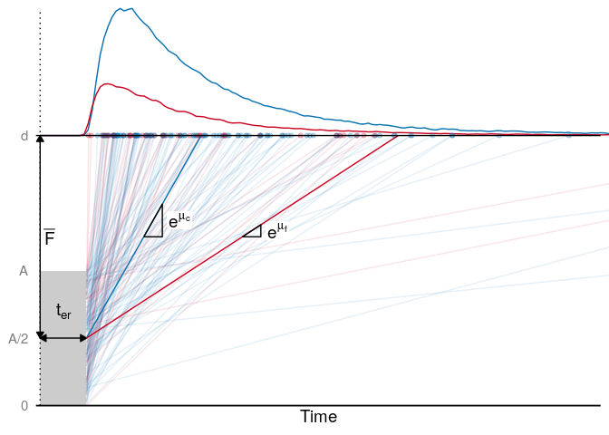

Extra visualisations of the mapping between ACT-R and LBA
================
Maarten van der Velde
Last updated: 2022-03-30

# Setup

``` r
library(dplyr)
library(ggplot2)
library(rtdists)
library(tidyr)
library(cowplot)
library(grid)
library(rlang)

theme_paper <- theme_classic(base_size = 14) + 
  theme(axis.text = element_text(colour = "black"))


set.seed(2021)
```

# ACT-R as an LBA

Visualise the ACT-R model in the style of an accumulator model.

Number of trials to simulate:

``` r
n_trials <- 1e5
```

Set the ACT-R parameters:

``` r
# Latency factor F
lf_mu <- 1.5
lf_range <- 1
lf_lower <- lf_mu - .5 * lf_range
lf_upper <- lf_mu + .5 * lf_range

# Non-retrieval time t_er
t_er <- 1

# Activation of correct answer
a_c_mu <- -.5
a_c_sd <- 1

# Activation of incorrect answer
a_f_mu <- -1.5
a_f_sd <- 1.5
```

``` r
sim_actr_viz <- tibble(
  f = runif(n_trials, min = lf_lower, max = lf_upper),
  a_c = rnorm(n_trials, mean = a_c_mu, sd = a_c_sd),
  a_f = rnorm(n_trials, mean = a_f_mu, sd = a_f_sd),
  t = rep(t_er, n_trials)
) %>%
  rowwise() %>%
  mutate(rt = f * exp(-max(a_c, a_f)) + t,
         response = ifelse(a_c > a_f, 1, 2)) %>%
  ungroup()

sim_actr_sample <- sample_n(sim_actr_viz, 150)
```

``` r
A <- lf_upper - lf_lower
    
p_actr_lba <- ggplot() +
  
  # t_er rectangle
  geom_rect(aes(xmax = t_er, xmin = 0, ymin = 0, ymax = A), fill = "grey80") +
  geom_segment(aes(xend = t_er, x = 0, y = A/2, yend = A/2), lty = 1,
               arrow = arrow(ends = "both", type = "closed", length = unit(2, "mm"))) +
  geom_text(aes(x = t_er/2, y = A/2 + .2, label = paste0(expression(t[er]))), parse = TRUE, size = rel(5)) +
  
  # Top density plot
  geom_density(data = sim_actr_viz,
               aes(x = rt, y = after_stat(count)/(nrow(sim_actr_viz)) + lf_upper, colour = as.factor(response)),
               n = 2^10,
               adjust = .05) +
  
  # Dotted y-axis
  geom_vline(xintercept = 0, lty = 3) +
  
  # F arrow
  geom_segment(aes(x = 0, xend = 0, y = A/2, yend = lf_upper),
               arrow = arrow(ends = "both", type = "closed", length = unit(2, "mm"))) +
  geom_text(aes(y = (lf_upper + A/2)/2, x = .2, label = paste0(expression(bar(F)))), parse = TRUE, size = rel(5)) +
  
  # Example trajectories
  geom_point(data = sim_actr_sample, aes(x = rt, colour = as.factor(response)), y = lf_upper, alpha = .25) +
  geom_segment(data = sim_actr_sample, aes(x = t, xend = rt, y = lf_upper - f, yend = lf_upper, colour = as.factor(response)), alpha = .1, lwd = rel(.5)) +
  
  # Mean drift rate lines
  geom_segment(aes(x = t_er, xend = lf_mu/exp(a_c_mu) + t_er, yend = lf_upper, y = lf_upper - lf_mu), colour = "#0571b0", lty = 1) +
  geom_path(aes(x = (lf_mu/exp(a_c_mu)) / 2 + t_er + c(0, .4, .4, 0),
                y = (lf_upper + A/2)/2 + c(0, 0, exp(a_c_mu)*.4, 0))) +
  geom_label(aes(x = (lf_mu/exp(a_c_mu)) / 2 + t_er + .775, y = (lf_upper + A/2)/2 + exp(a_c_mu)*.2,
                 label = paste0(expression(e^mu[c]))),
             parse = TRUE, label.size = NA, size = rel(5), label.padding = unit(.1, "lines")) +
  
  geom_segment(aes(x = t_er, xend = lf_mu/exp(a_f_mu) + t_er, yend = lf_upper, y = lf_upper - lf_mu), colour = "#ca0020", lty = 1) +
  geom_path(aes(x = (lf_mu/exp(a_f_mu)) / 2 + t_er + c(0, .4, .4, 0),
                y = (lf_upper + A/2)/2 + c(0, 0, exp(a_f_mu)*.4, 0))) +
  geom_label(aes(x = (lf_mu/exp(a_f_mu)) / 2 + t_er + .75, y = (lf_upper + A/2)/2 + exp(a_f_mu)*.2,
                 label = paste0(expression(e^mu[f]))),
             parse = TRUE, label.size = NA, size = rel(5), label.padding = unit(.1, "lines")) +
  
  
  # Boundary line
  geom_hline(yintercept = lf_upper) +
  
  scale_x_continuous(expand = c(.0075,0), breaks = NULL) +
  coord_cartesian(xlim = c(0, 12), clip = "off") +
  scale_y_continuous(expand = c(0,0), limits = c(0, NA),
                     breaks = c(0, A/2, A, lf_upper),
                     labels = c(0, "A/2", "A", "d")) +
  scale_colour_manual(values = c("#0571b0", "#ca0020")) +
  labs(x = "Time",
       y = NULL) +
  guides(colour = FALSE) +
  theme_paper +
  theme(axis.ticks.y = element_blank(),
        axis.line.y = element_blank(),
        axis.text.y = element_text(colour = "grey50"))
```

    ## Warning: `guides(<scale> = FALSE)` is deprecated. Please use
    ## `guides(<scale> = "none")` instead.

``` r
p_actr_lba
```

<!-- -->

# Comparison between models

Verify that with the same set of parameters, ACT-R and the LBA produce
the same RT distribution.

``` r
sim_actr <- tibble(
  f = runif(n_trials, min = lf_lower, max = lf_upper),
  a_c = rnorm(n_trials, mean = a_c_mu, sd = a_c_sd),
  a_f = rnorm(n_trials, mean = a_f_mu, sd = a_f_sd),
  t = rep(t_er, n_trials)
) %>%
  rowwise() %>%
  mutate(rt = f * exp(-max(a_c, a_f)) + t,
         response = ifelse(a_c > a_f, 1, 2)) %>%
  ungroup() %>%
  mutate(model = "ACT-R",
         rt = ifelse(response == 1, rt, -rt))


A <- lf_upper - lf_lower
b <- lf_upper

dlba_dat <- expand.grid(rt = seq(0, 20, by = .01),
                        response = c(1, 2))

sim_lba <- bind_cols(dlba_dat,
                     density = dLBA(rt = dlba_dat$rt,
                                    response = dlba_dat$response,
                                    A = A,
                                    b = b,
                                    t0 = t_er,
                                    meanlog_v = c(a_c_mu, a_f_mu),
                                    sdlog_v = c(a_c_sd, a_f_sd),
                                    distribution = "lnorm",
                                    silent = TRUE)) %>%
  mutate(rt = ifelse(response == 1, rt, -rt),
         model = "LBA")
```

``` r
draw_key_custom <- function(data, params, size) {
  if(data$colour == "#000000" && data$size == .5) { # ACT-R
    grobTree(
      linesGrob(
        c(.1, .1, .3, .3, .3, .5, .5, .5, .7, .7, .7, .9, .9),
        c(0, .5, .5, 0, .8, .8, 0, .65, .65, 0, .4, .4, 0)
      ),
      gp = gpar(
        col = data$colour %||% "grey20",
        fill = alpha(data$fill %||% "white", data$alpha),
        lwd = (data$size %||% 0.5) * .pt,
        lty = data$linetype %||% 1
      )
    )
  } 
  else if (data$colour == "#e66101" && data$size == 2) { # LBA
    grobTree(
      linesGrob(
        c(0, 1),
        c(.5, .5)
      ),
      gp = gpar(
        col = alpha(data$colour %||% "grey20", data$alpha),
        fill = alpha(data$fill %||% "white", data$alpha),
        lwd = (data$size %||% 0.5) * .pt,
        lty = data$linetype %||% 1
      )
    )
  }
  else {
    grobTree() # Don't draw
  }
}

p_rt_comp <- ggplot(sim_actr, aes(x = rt, colour = model)) +
  geom_vline(xintercept = 0, lty = 2, colour = "grey80") +
  geom_histogram(aes(y = ..density..), binwidth = .5, fill = NA, size = rel(.5), key_glyph = draw_key_custom) +
  geom_line(data = sim_lba, aes(y = density), size = rel(2), alpha = .7, key_glyph = draw_key_custom) +
  scale_x_continuous(limits = c(-20, 20)) +
  scale_y_continuous(limits = c(0, max(sim_lba$density) + .01), expand = c(0, 0)) +
  scale_colour_manual(values = c("#000000", "#e66101")) +
  labs(x = "RT (s)",
       y = "Density",
       colour = NULL) +
  theme_paper +
  theme(axis.ticks.y = element_blank(),
        axis.text.y = element_blank(),
        legend.position = c(.85, .85))

p_rt_comp
```

    ## Warning: Removed 542 rows containing non-finite values (stat_bin).

    ## Warning: Removed 2 rows containing missing values.

<!-- -->

Combination plot for in the paper:

``` r
plot_grid(p_actr_lba, p_rt_comp,
          labels = "AUTO",
          align = "h",
          axis = "tb",
          rel_widths = c(1, .7))
```

    ## Warning: Removed 542 rows containing non-finite values (stat_bin).

    ## Warning: Removed 2 rows containing missing values.

<!-- -->

``` r
ggsave(file.path("..", "output", "sim-actr-combi.pdf"), width = 9, height = 3)
```

Make separate PNGs for in the
presentation:

``` r
ggsave(plot = p_actr_lba, filename = file.path("..", "output", "sim-actr-presentation.png"), width = 4.5, height = 3, dpi = 600)

ggsave(plot = p_rt_comp, filename = file.path("..", "output", "sim-rt-comparison-presentation.png"), width = 4.5, height = 3, dpi = 600)
```

    ## Warning: Removed 542 rows containing non-finite values (stat_bin).

    ## Warning: Removed 2 rows containing missing values.

# Session info

``` r
sessionInfo()
```

    ## R version 3.6.3 (2020-02-29)
    ## Platform: x86_64-pc-linux-gnu (64-bit)
    ## Running under: Ubuntu 18.04.6 LTS
    ## 
    ## Matrix products: default
    ## BLAS:   /usr/lib/x86_64-linux-gnu/blas/libblas.so.3.7.1
    ## LAPACK: /usr/lib/x86_64-linux-gnu/lapack/liblapack.so.3.7.1
    ## 
    ## locale:
    ##  [1] LC_CTYPE=en_US.UTF-8       LC_NUMERIC=C              
    ##  [3] LC_TIME=nl_NL.UTF-8        LC_COLLATE=en_US.UTF-8    
    ##  [5] LC_MONETARY=nl_NL.UTF-8    LC_MESSAGES=en_US.UTF-8   
    ##  [7] LC_PAPER=nl_NL.UTF-8       LC_NAME=C                 
    ##  [9] LC_ADDRESS=C               LC_TELEPHONE=C            
    ## [11] LC_MEASUREMENT=nl_NL.UTF-8 LC_IDENTIFICATION=C       
    ## 
    ## attached base packages:
    ## [1] grid      stats     graphics  grDevices utils     datasets  methods  
    ## [8] base     
    ## 
    ## other attached packages:
    ## [1] rlang_0.4.10   cowplot_0.9.4  tidyr_1.0.0    rtdists_0.11-2
    ## [5] ggplot2_3.3.5  dplyr_1.0.7   
    ## 
    ## loaded via a namespace (and not attached):
    ##  [1] Rcpp_1.0.6        pillar_1.6.3      compiler_3.6.3   
    ##  [4] tools_3.6.3       digest_0.6.19     evd_2.3-3        
    ##  [7] jsonlite_1.6      lattice_0.20-41   evaluate_0.14    
    ## [10] lifecycle_1.0.1   tibble_2.1.3      gtable_0.3.0     
    ## [13] pkgconfig_2.0.2   Matrix_1.2-18     DBI_1.1.0        
    ## [16] yaml_2.2.0        expm_0.999-4      mvtnorm_1.1-1    
    ## [19] xfun_0.21         withr_2.3.0       stringr_1.4.0    
    ## [22] knitr_1.23        generics_0.1.0    vctrs_0.3.8      
    ## [25] tidyselect_1.1.1  glue_1.4.2        R6_2.4.0         
    ## [28] fansi_0.4.0       survival_2.44-1.1 rmarkdown_2.6    
    ## [31] farver_2.1.0      purrr_0.3.2       magrittr_2.0.1   
    ## [34] splines_3.6.3     scales_1.1.1      ellipsis_0.3.2   
    ## [37] htmltools_0.3.6   colorspace_1.4-1  labeling_0.3     
    ## [40] utf8_1.1.4        stringi_1.4.3     gsl_2.1-6        
    ## [43] munsell_0.5.0     msm_1.6.8         crayon_1.4.1
